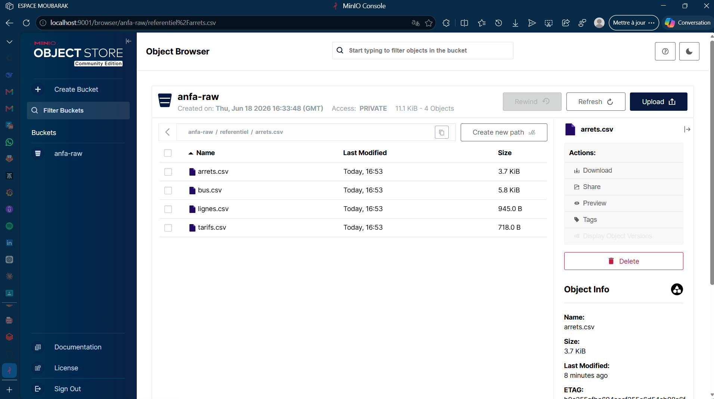

# Rendu Séance 1
**Nom et prénom :** KOMBATE GARIBA Moubarak 
## Résumé de la séance
Cette séance a permis de mettre en œuvre un pipeline complet d’ingestion de données en environnement conteneurisé. Après avoir vérifié les prérequis techniques (Docker, Python, Git), nous avons forké le dépôt du cours et créé une branche de travail dédiée. Nous avons ensuite déployé un serveur MinIO (stockage objet compatible S3) via Docker, d’abord en ligne de commande puis en orchestrant le conteneur à l’aide d’un fichier docker-compose.yml intégrant des volumes persistants et des identifiants sécurisés. L’administration du serveur a été réalisée avec le client mc (création de bucket, gestion des accès), puis un script Python utilisant la bibliothèque boto3 a permis de déposer un fichier de données (référentiel d’Anfa) dans le bucket. Enfin, nous avons consolidé les résultats, les captures d’écran et les réponses aux questions pour rédiger le rendu final.

## Étapes principales
- Installation et vérification de l'environnement
- Forker le dépôt du cours et préparer votre branche de travail  
- Récupérer l'image MinIO et la lancer  
- Administrer MinIO en ligne de commande avec **mc**  
- Déposer le référentiel d'Anfa via **Python**  
- Récupération de l'image et administration de l'image MinIO avec **docker-compose.yml**  
- Rédaction du **RENDU** et soumission  


## Capture d'écran

## Difficultés rencontrées
Les principales difficultés rencontrées lors de cette séance concernent la prise en main de l’écosystème Docker, notamment la distinction entre l’image et le conteneur, le mapping des ports (-p) et le montage des volumes persistants via le fichier docker-compose.yml, dont la syntaxe YAML et la gestion des variables d’environnement ont nécessité une attention particulière. L’administration de MinIO a également posé problème, tant au niveau de la configuration du client mc (alias et commandes) qu’au niveau de l’authentification dans le script Python avec boto3 : l’erreur récurrente InvalidAccessKeyId provenait de l’utilisation des identifiants root dans le code, alors que MinIO exige des clés applicatives dédiées générées spécifiquement pour l’accès programmatique. Enfin, les opérations Git (fork, création de branche et synchronisation) ont demandé un temps d’adaptation pour les membres peu familiers avec ces outils. Ces obstacles ont toutefois permis de mieux appréhender les mécanismes de sécurisation, d’orchestration des conteneurs et les bonnes pratiques d’intégration entre services.
## Exercices d'application
## Exercice 1 : QCM conceptuel

**1.1** – **Réponse D** (« Open source obligatoire »).  
*Justification* : Le NIST définit cinq caractéristiques essentielles (libre-service à la demande, large accès réseau, mutualisation des ressources, élasticité rapide, service mesuré) ; l’open source n’est pas une obligation, le cloud peut très bien être propriétaire.

**1.2** – **Réponse C** (SaaS).  
*Justification* : Gmail est une application web complète, accessible via un navigateur, sans gestion d’infrastructure ni de développement ; c’est le modèle SaaS (Software as a Service).

**1.3** – **Réponse D** (FaaS).  
*Justification* : Le besoin est une fonction exécutée à la volée sur un événement (arrivée d’une position GPS), sans serveur permanent ; c’est typiquement le Function as a Service (ex : AWS Lambda).

**1.4** – **Réponse C** (Cloud hybride).  
*Justification* : Les données sensibles restent dans un cloud privé ou on‑premise (conformité), tandis que les analyses non sensibles peuvent profiter de l’élasticité du cloud public ; le modèle hybride combine les deux.

**1.5** – **Réponse B** (situation où une entreprise ne peut plus changer de fournisseur sans coûts ou risques majeurs).  
*Justification* : Le vendor lock‑in désigne la dépendance forte à un fournisseur qui rend la migration difficile et coûteuse.

**1.6** – **Réponse C** (« Un service open source est forcément moins performant qu’un service managé propriétaire »).  
*Justification* : C’est faux, de nombreux services open source (ex : Kafka, Spark) sont aussi performants que leurs équivalents managés, voire plus, et la performance dépend de l’implémentation et de l’infrastructure, pas du modèle de licence.

---

## Exercice 2 : Classification de services

| Service | Modèle | Justification |
|---------|--------|----------------|
| Google Compute Engine (machine virtuelle) | **IaaS** | Fournit des ressources de calcul virtualisées (VM) ; l’utilisateur gère l’OS et les applications. |
| AWS Lambda | **FaaS** | Exécute du code en réponse à des événements, sans gestion de serveur ; paiement à l’exécution. |
| Snowflake (entrepôt de données) | **SaaS** | Service entièrement managé de data warehouse ; l’utilisateur interagit via SQL, sans se soucier de l’infrastructure. |
| Heroku | **PaaS** | Plateforme de déploiement d’applications ; l’utilisateur pousse son code, Heroku gère les serveurs et le scaling. |
| Microsoft 365 (Word, Excel en ligne) | **SaaS** | Applications bureautiques accessibles en ligne, sans installation ni gestion. |
| Databricks (Spark managé) | **PaaS** (ou SaaS avancé) | Fournit un environnement Spark et des notebooks, avec gestion automatisée des clusters, mais l’utilisateur reste maître du code et des configurations. |
| Azure Functions | **FaaS** | Exécution de fonctions déclenchées par des événements, sans gestion de serveur. |
| Tableau Online | **SaaS** | Plateforme de visualisation de données hébergée, accessible via navigateur, pas d’installation. |

---

## Exercice 3 : Lecture et interprétation (Docker)

### 3.1 Commande `docker run`

Voici le détail de chaque option de la commande :

```bash
docker run -d --name analyse-anfa -p 8888:8888 -v /home/koffi/notebooks:/notebooks \
-e JUPYTER_TOKEN=anfa-token jupyter/pyspark-notebook
```

- **`-d`** : Détache le conteneur (le lance en arrière‑plan).  
- **`--name analyse-anfa`** : Donne le nom « analyse-anfa » au conteneur pour le retrouver facilement.  
- **`-p 8888:8888`** : Mappe le port 8888 de l’hôte sur le port 8888 du conteneur (port par défaut de Jupyter).  
- **`-v /home/koffi/notebooks:/notebooks`** : Monte le répertoire local `/home/koffi/notebooks` dans le conteneur sous `/notebooks` ; les notebooks seront persistants et modifiables depuis l’hôte.  
- **`-e JUPYTER_TOKEN=anfa-token`** : Définit la variable d’environnement `JUPYTER_TOKEN` avec la valeur `anfa-token` ; ce token sera exigé pour accéder à Jupyter.  
- **`jupyter/pyspark-notebook`** : Nom de l’image Docker utilisée (Jupyter avec Spark pré‑installé).  

**Interprétation de la commande entière :**  
Elle lance un conteneur Jupyter avec Spark, en arrière‑plan, nommé `analyse-anfa`, accessible sur `http://localhost:8888` (avec le token `anfa-token`), et les notebooks sont sauvegardés dans le dossier de l’hôte pour éviter toute perte.

---

### 3.2 Lecture du `docker-compose.yml`

Fichier fourni :

```yaml
services:
  minio:
    image: minio/minio:latest
    container_name: anfa-minio
    restart: always
    ports:
      - "9000:9000"
      - "9001:9001"
    environment:
      MINIO_ROOT_USER: anfa-admin
      MINIO_ROOT_PASSWORD: secret
    volumes:
      - minio-data:/data
    command: server /data --console-address ":9001"

volumes:
  minio-data:
```

**a.** Le service MinIO expose les ports :  
- `9000` pour l’API S3 (accès en programmation) → `http://localhost:9000`  
- `9001` pour la console web d’administration → `http://localhost:9001`

**b.** Si on supprime le conteneur (`docker rm anfa-minio`) puis on relance `docker compose up -d`, les données **ne sont pas perdues** car un volume nommé `minio-data` est déclaré dans la section `volumes`. Docker conserve ce volume indépendamment du cycle de vie du conteneur ; les données restent présentes et seront ré‑attachées au nouveau conteneur.

**c.** **Problème de sécurité** : les identifiants root (`MINIO_ROOT_USER` et `MINIO_ROOT_PASSWORD`) sont écrits en clair dans le fichier `docker-compose.yml`. En production, il faudrait utiliser un fichier `.env` externe, un gestionnaire de secrets (ex : Docker Secrets, HashiCorp Vault) ou des variables d’environnement injectées au runtime.

---

## Exercice 4 : Diagnostic (MinIO)

Code de l’étudiant :

```python
import boto3
s3 = boto3.client(
    "s3",
    endpoint_url="http://localhost:9000",
    aws_access_key_id="anfa-admin",
    aws_secret_access_key="anfa-password-2026",
    region_name="us-east-1",
)
s3.upload_file("trajets.csv", "anfa-raw", "trajets.csv")
```

**a. Cause précise de l’erreur** :  
L’erreur `InvalidAccessKeyId` signifie que l’`access_key_id` fourni n’est pas reconnu par MinIO.  
Ici, l’étudiant utilise `anfa-admin` comme `aws_access_key_id`, mais il a créé une clé applicative via `mc` (probablement un nom différent). Les identifiants root (`anfa-admin` / `secret`) fonctionnent pour la console web mais aussi pour l’API S3 *si on les utilise*. Cependant, le code utilise `aws_secret_access_key = "anfa-password-2026"` qui ne correspond ni au mot de passe root (probablement `secret`) ni à la clé secrète de la clé applicative créée. La cause précise est donc une **incohérence entre les identifiants utilisés et ceux enregistrés dans MinIO** pour l’accès programmatique.

**b. Correction du code** :  
Il faut remplacer `aws_access_key_id` et `aws_secret_access_key` par les véritables identifiants de la clé applicative qu’il a créée avec `mc`. Par exemple :

```python
aws_access_key_id = "anfa-app-key"          # nom de la clé créée via mc
aws_secret_access_key = "anfa-app-secret-2026"   # sa clé secrète
```

Ou, s’il souhaite utiliser le compte root, il doit mettre `secret` comme mot de passe (correspondant à `MINIO_ROOT_PASSWORD`).

**c. Pourquoi MinIO refuse-t-il `anfa-admin` / `anfa-password-2026` ?**  
MinIO refuse ces identifiants car `anfa-password-2026` n’est pas le mot de passe associé à l’utilisateur `anfa-admin`. Le mot de passe root est défini dans la variable `MINIO_ROOT_PASSWORD=secret` (dans le docker‑compose). Les identifiants root sont bien reconnus pour la console web car MinIO utilise le même système d’authentification, mais le mot de passe doit correspondre.

---

## Exercice 5 : Mini‑cas d’architecture

**a. Limites de l’architecture actuelle** :  
1. Le data scientist utilise un export CSV mensuel ⇒ les données ne sont pas à jour, impossible d’avoir des prédictions horaires.  
2. Le PC portable a une capacité de calcul limitée ⇒ impossible de monter en charge lors des pics de demande (vendredi soir, fêtes).

**b. Correspondance besoin ↔ caractéristique NIST** :  

- **Prédictions quasi temps réel (chaque heure)** → *Élasticité rapide* : permet d’allouer dynamiquement des ressources de calcul pour exécuter le modèle chaque heure.  
- **Tableau de bord partagé sans installation** → *Large accès réseau* : accessible depuis n’importe quel navigateur, partout.  
- **Augmenter la capacité lors des pics** → *Élasticité rapide* : on peut provisionner plus de nœuds pendant les pics et les libérer ensuite.  
- **Maîtrise des coûts** → *Service mesuré* : on paie uniquement pour les ressources consommées (modèle pay‑as‑you‑go).  
- **Conserver les données clients dans un environnement contrôlé** → *Mutualisation des ressources* (avec isolation) ou *libre-service* pour définir des politiques de sécurité, mais aussi recours à un cloud privé.

**c. Propositions de modèles de service** :  

- **(i) Tableau de bord partagé** → **SaaS** : utiliser un outil comme Power BI, Tableau Online ou Google Data Studio, qui est prêt à l’emploi et accessible en ligne.  
- **(ii) Calcul des prédictions à l’heure** → **FaaS** : une fonction (ex : AWS Lambda) déclenchée par un scheduler toutes les heures, sans serveur permanent, coût réduit.  
- **(iii) Stockage des données clients** → **IaaS** ou **PaaS** : par exemple, un bucket S3 (IaaS) ou une base de données managée (PaaS) ; l’important est de garder le contrôle sur la localisation et les accès.

**d. Modèle de déploiement recommandé** : **Cloud hybride**.  
Les données clients sensibles restent dans un cloud privé (ou sur site) pour respecter la conformité, tandis que les calculs élastiques (prédictions) et le tableau de bord peuvent utiliser un cloud public, avec des données anonymisées ou agrégées si nécessaire. L’hybride permet à la fois la sécurité et l’élasticité.

**e. Trois stratégies pour limiter le vendor lock‑in** :  
1. **Utiliser des conteneurs (Docker, Kubernetes)** : standardiser l’exécution des applications, ce qui facilite la migration vers un autre fournisseur cloud.  
2. **Privilégier des services open source** : par exemple, MinIO (stockage objet), Apache Kafka (streaming), PostgreSQL (base de données) – leurs API sont souvent compatibles entre clouds.  
3. **Adopter une infrastructure codée (IaC)** avec Terraform ou Ansible : décrire l’infrastructure de manière déclarative, ce qui permet de re‑créer l’environnement chez un autre fournisseur en changeant uniquement les providers.
```