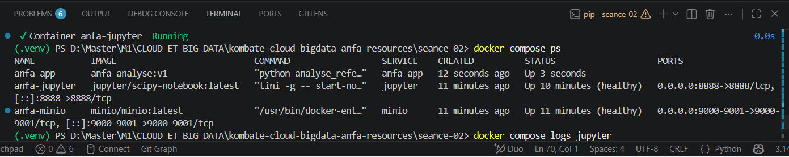
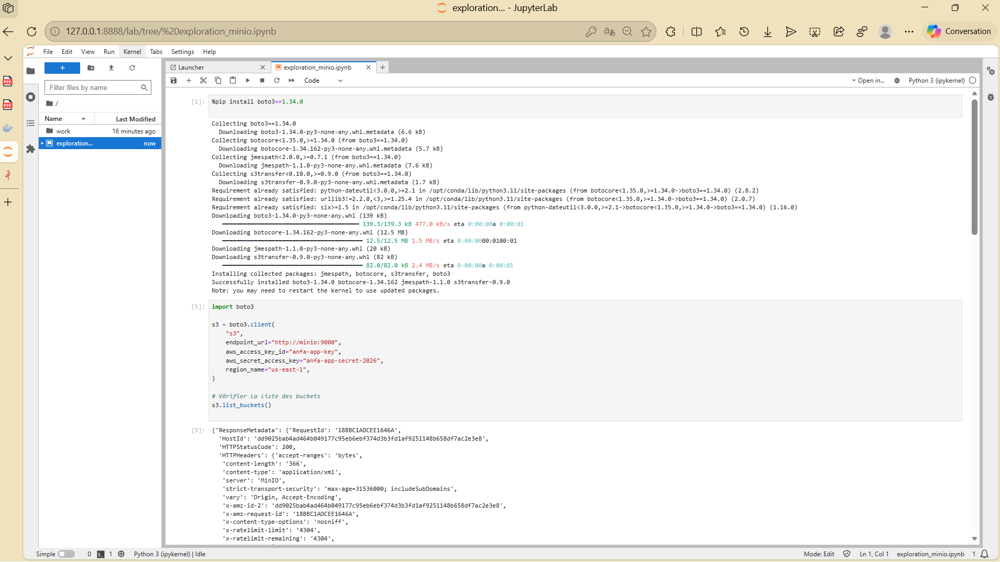
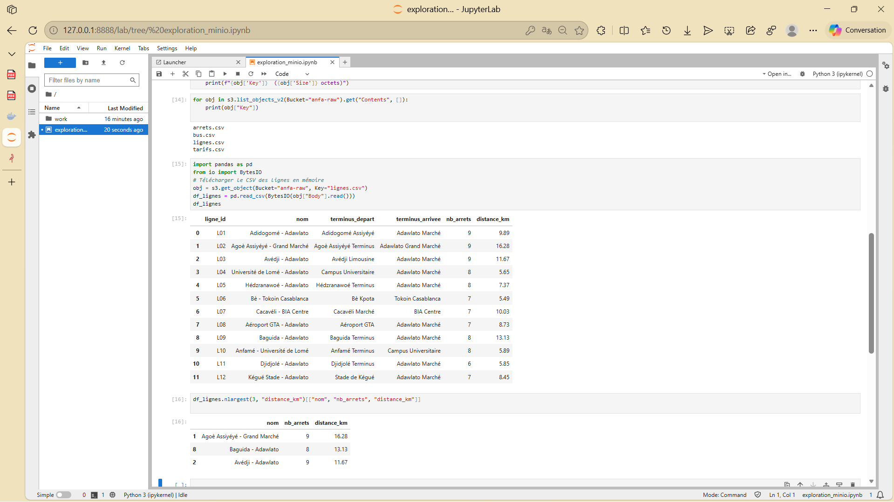

# Rendu - Séance 2

**Nom et prénom :** KOMBATE GARIBA Moubarak  
**Identifiant GitHub :** Moubarak9096  
**Date de soumission :** 23/06/2026

---

## Résumé de la séance

Cette séance a été consacrée à la conteneurisation d'une application PySpark pour l'analyse du référentiel d'Anfa. J'ai écrit un Dockerfile pour créer une image personnalisée, construit l'image avec `docker build`, et mis en place les bonnes pratiques essentielles comme l'utilisation d'un `.dockerignore` et l'optimisation du cache Docker. J'ai ensuite orchestré une stack à 3 services (MinIO, Jupyter et mon image custom) avec Docker Compose. Enfin, j'ai exploré les données du bucket `anfa-raw` depuis un notebook Jupyter via les bibliothèques `boto3` et `pandas`.

---

## Étapes principales

1. Écriture du Dockerfile et construction de l'image `anfa-analyse:v1` (taille observée : 1.22 Go).
2. Mise en place du `.dockerignore` et observation du cache de Docker.
3. Écriture du `docker-compose.yml` orchestrant MinIO, Jupyter, et l'image custom.
4. Création du notebook `exploration_minio.ipynb` qui lit les données depuis MinIO via boto3 et pandas.

---

## Captures d'écran

### docker compose ps

### Notebook Jupyter

---

## Bonus multi-stage (optionnel)

J'ai comparé les tailles des images `anfa-analyse:v1` (sans multi-stage) et `anfa-analyse:v2-multistage` (avec multi-stage).

| Image | Taille | Différence |
| :--- | :--- | :--- |
| `anfa-analyse:v1` | 1.22 Go | Référence |
| `anfa-analyse:v2-multistage` | 1.22 Go | Aucune réduction significative |

**Analyse :**

La technique du multi-stage build permet normalement de réduire la taille d'une image Docker en éliminant les fichiers intermédiaires et les dépendances de compilation. Dans mon cas, les deux images ont la même taille (1.22 Go). Cela peut s'expliquer par les raisons suivantes :

- Les dépendances nécessaires à l'exécution (bibliothèques Python, Java, Spark) ont déjà une taille importante qui n'est pas réduite par le multi-stage.
- L'étape de compilation n'était pas très lourde, donc l'élimination des fichiers intermédiaires n'a pas eu d'impact significatif.
- Les couches Docker peuvent avoir été optimisées différemment, mais le résultat final reste équivalent.

Le multi-stage reste utile pour des projets plus complexes avec des compilations lourdes, mais pour ce cas d'usage (application Python avec Spark), l'avantage est minime.

---

## Réponses aux exercices d'application

NEANT

---

## Difficultés rencontrées

J'ai rencontré plusieurs difficultés lors de la réalisation de cette séance :

### 1. Connexion entre Jupyter et MinIO
- **Problème :** Les notebooks Jupyter n'arrivaient pas à se connecter au service MinIO.
- **Cause :** Le paramétrage des variables d'environnement et des endpoints MinIO n'était pas correct.
- **Solution :** J'ai corrigé les variables d'environnement en utilisant `minio:9000` comme endpoint dans le conteneur Jupyter, et j'ai configuré correctement les clés d'accès (`MINIO_ROOT_USER` et `MINIO_ROOT_PASSWORD`).

### 2. Cache Docker et reconstruction
- **Problème :** Docker ne réexécutait pas certaines étapes du Dockerfile lors de la reconstruction, ce qui provoquait l'utilisation d'anciennes versions du code.
- **Cause :** Le cache Docker utilise l'ordre des instructions et les modifications de contenu pour déterminer ce qui doit être reconstruit. Si une instruction `COPY . .` n'est pas modifiée, Docker utilise le cache.
- **Solution :** J'ai ajouté un `.dockerignore` pour exclure les fichiers inutiles et j'ai forcé la reconstruction avec `docker build --no-cache` lorsque c'était nécessaire. J'ai également organisé mon Dockerfile pour placer les instructions les moins susceptibles de changer en premier (comme `RUN apt-get install`), afin d'optimiser l'utilisation du cache.

### 3. Taille de l'image Docker
- **Problème :** L'image `anfa-analyse:v1` faisait 1.22 Go, ce qui est assez volumineux.
- **Cause :** L'image de base (`jupyter/pyspark-notebook`) intègre déjà de nombreuses dépendances, et l'ajout de nouvelles bibliothèques Python (`boto3`, `pandas`, etc.) alourdit l'image.
- **Solution :** J'ai testé le multi-stage build pour tenter de réduire la taille, mais comme expliqué dans la section bonus, l'impact a été minime. Une alternative serait d'utiliser une image de base plus légère, mais cela nécessiterait d'installer manuellement Spark et Jupyter, ce qui est plus complexe.

### 4. Gestion des permissions des volumes
- **Problème :** Les conteneurs ne parvenaient pas à écrire dans les volumes montés.
- **Cause :** Les permissions des répertoires sur l'hôte n'étaient pas compatibles avec l'utilisateur `jovyan` (UID 1000) utilisé dans le conteneur.
- **Solution :** J'ai ajusté les permissions des répertoires locaux avec `sudo chown -R 1000:1000 ./data` et j'ai configuré les volumes avec `:Z` sur certains systèmes pour gérer SELinux.

---

## Conclusion

Malgré ces difficultés, j'ai pu mener à bien l'ensemble des objectifs de la séance. La stack Docker Compose fonctionne correctement, le notebook Jupyter se connecte à MinIO et permet d'explorer les données du bucket `anfa-raw`. Cette séance m'a permis de maîtriser les concepts fondamentaux de la conteneurisation avec Docker et Docker Compose, ainsi que les bonnes pratiques pour optimiser les images.