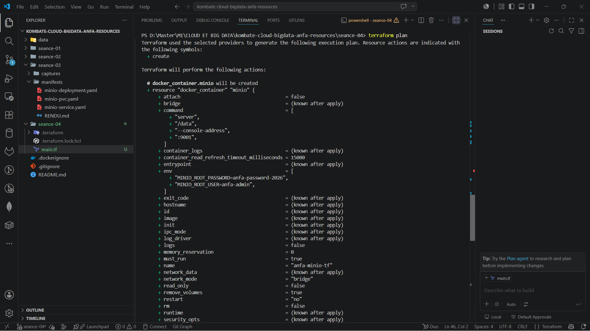
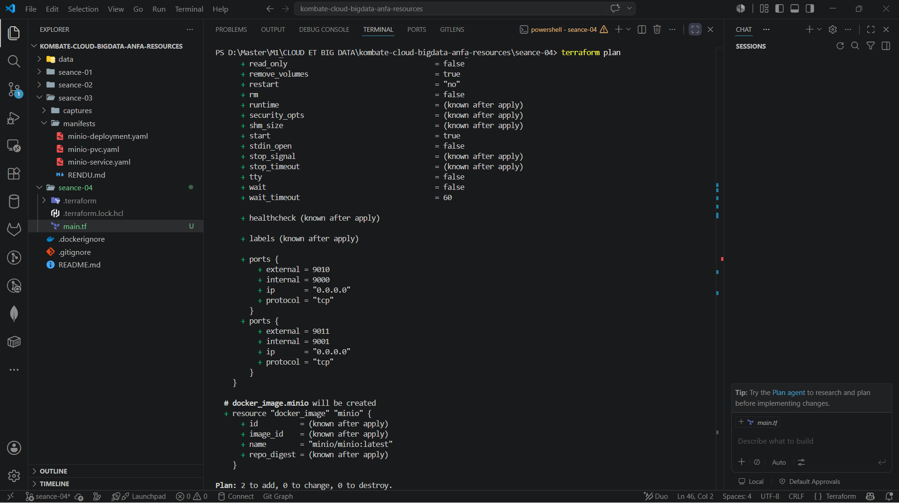
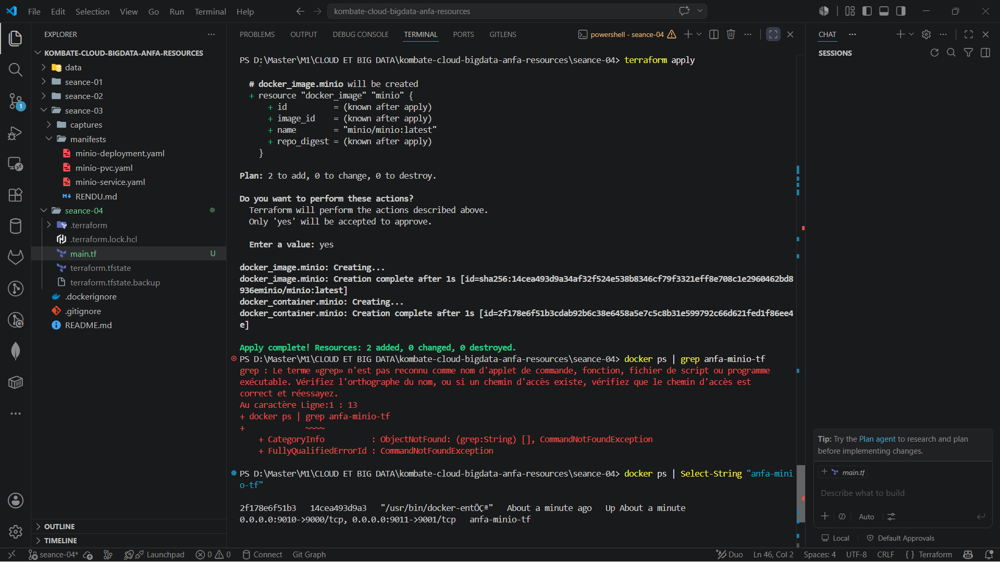
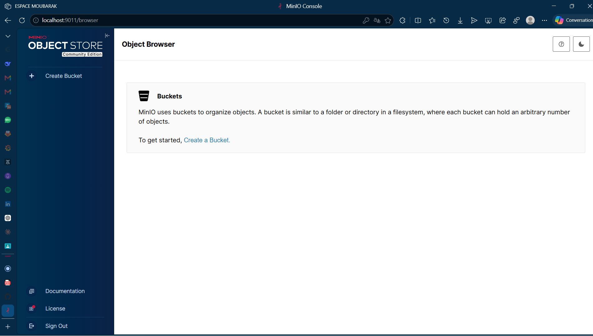

```markdown
# Rendu — Séance 4

**Nom et prénom :** KOMBATE GARIBA Moubarak  
**Identifiant GitHub :** Moubarak9096  
**Date de soumission :** 27/06/2026  

---

## Résumé de la séance

Terraform a été installé et pris en main via le workflow classique (init, plan, apply, destroy). Une infrastructure Docker complète (réseau, volume, conteneur MinIO) a été décrite en HCL, paramétrée via des variables et un fichier `.tfvars`, démontrant la puissance de l'IaC pour gérer des environnements reproductibles et versionnés.

---

## Étapes principales

1. Installation de Terraform et création d'un premier `main.tf` minimal pour valider l'environnement.
2. Maîtrise du workflow fondamental : `init` → `plan` → `apply` → `destroy`.
3. Compréhension du mécanisme de state Terraform et des bonnes pratiques de versioning (ne pas committer le `.tfstate`).
4. Construction d'une stack complète : réseau Docker, volume persistant, et conteneur MinIO.
5. Refactoring du code avec introduction de variables et d'un fichier `terraform.tfvars` pour la paramétrisation.

---

## Captures d'écran

### `terraform plan` (création initiale)

  


### `terraform apply` réussi



### Console MinIO créée par Terraform



### `terraform destroy`


---


## Réponses aux exercices d'application


### Exercice 1 - QCM conceptuel

**1.1** Parmi ces affirmations sur l'Infrastructure as Code, laquelle est fausse ?  
**Réponse : B**  
*Justification :* L'IaC ne remplace pas la compréhension de l'infrastructure sous-jacente ; elle la formalise, mais l'opérateur doit toujours comprendre ce qu'il décrit pour éviter des erreurs de conception ou de sécurité.

**1.2** Quelle est la différence fondamentale entre une approche déclarative et une approche impérative ?  
**Réponse : B**  
*Justification :* Le déclaratif se concentre sur l'état final souhaité ("quoi"), tandis que l'impératif décrit les étapes ("comment") pour atteindre cet état.

**1.3** Que signifie qu'une opération est idempotente ?  
**Réponse : B**  
*Justification :* Une opération idempotente peut être exécutée plusieurs fois sans changer le résultat au-delà de la première application, ce qui est crucial pour l'automatisation.

**1.4** À quoi sert un provider dans Terraform ?  
**Réponse : B**  
*Justification :* Le provider est le plugin qui fait le pont entre Terraform et l'API du service cible (AWS, Docker, etc.), permettant la gestion des ressources.

**1.5** Que se passe-t-il si vous lancez `terraform apply` deux fois de suite sans modifier votre code ?  
**Réponse : B**  
*Justification :* Terraform compare l'état souhaité (le code) à l'état réel (le state). S'ils sont identiques, il n'y a rien à faire.

**1.6** Quelle est la fonction du fichier `terraform.tfstate` ?  
**Réponse : C**  
*Justification :* Le state est la source de vérité de Terraform ; il mémorise le mapping entre les ressources du code et les objets réels pour gérer les mises à jour incrémentales.

**1.7** Pourquoi ne faut-il jamais committer le fichier `terraform.tfstate` dans Git ?  
**Réponse : B**  
*Justification :* Il peut contenir des secrets en clair et, en cas de modifications concurrentes, il est très difficile à fusionner, ce qui peut corrompre l'état de l'infrastructure.

**1.8** Quelle commande exécutez-vous avant `terraform apply` pour vérifier ce qui va changer ?  
**Réponse : B**  
*Justification :* `terraform plan` analyse le code et le state pour montrer un plan d'action détaillé sans appliquer de changements.

**1.9** Que représente OpenTofu ?  
**Réponse : B**  
*Justification :* OpenTofu est un fork open source de Terraform, créé en réaction au changement de licence de HashiCorp vers une licence plus restrictive (BSL).

**1.10** Terraform et Ansible sont-ils des outils concurrents ?  
**Réponse : B**  
*Justification :* Terraform est un outil de provisionnement ("créer l'infrastructure"), tandis qu'Ansible est un outil de configuration ("installer et configurer les logiciels"). Ils sont complémentaires.

---

### Exercice 2 - Lecture et interprétation d'un fichier Terraform

**2.1** Listez les 4 resources définies dans ce fichier, et expliquez en une ligne ce que chacune fait.

1.  `docker_network.back` : Crée un réseau Docker nommé `anfa-backend` pour isoler et connecter les conteneurs.
2.  `docker_volume.data` : Crée un volume Docker nommé `postgres-data` pour persister les données de la base de données.
3.  `docker_image.postgres` : Télécharge l'image Docker `postgres:15` depuis Docker Hub pour pouvoir l'utiliser.
4.  `docker_container.db` : Crée et démarre un conteneur PostgreSQL nommé `anfa-postgres` basé sur l'image téléchargée.

**2.2** Dans la ligne `image = docker_image.postgres.image_id`, à quoi correspond `docker_image.postgres.image_id` ? Qu'est-ce que cette référence apporte par rapport à écrire `image = "postgres:15"` directement ?  
`docker_image.postgres.image_id` est une référence à l'attribut `image_id` de la ressource `docker_image` nommée `postgres`. Cela correspond à l'ID unique (le hash) de l'image téléchargée sur la machine.  
L'intérêt est de forcer une dépendance explicite : Terraform sait qu'il doit créer/télécharger l'image avant de créer le conteneur. En écrivant `"postgres:15"` directement, on perd cette dépendance implicite (même si dans ce cas précis, Docker arriverait à la résoudre).

**2.3** Si l'étudiant lance `terraform apply` pour la première fois, dans quel ordre Terraform créera-t-il les resources ? Pourquoi ?  
Terraform créera les ressources dans l'ordre suivant :  
1.  `docker_network.back`  
2.  `docker_volume.data`  
3.  `docker_image.postgres`  
4.  `docker_container.db`  

*Justification :* Le conteneur `db` référence le réseau (`networks_advanced`), le volume (`volumes`) et l'image (`image`). Terraform analyse ces graphes de dépendances et crée donc les dépendances (réseau, volume, image) avant le conteneur. Le réseau, le volume et l'image n'ayant pas de dépendances entre eux, leur ordre de création peut être parallélisé ou non-déterminé.

**2.4** Quel est le problème principal de ce fichier sur le plan de la sécurité ? Proposez une correction concrète (en quelques lignes de code).  
Le problème principal est le mot de passe PostgreSQL (`POSTGRES_PASSWORD=secret123`) écrit en clair dans le code (en dur).  
**Correction :** Utiliser une variable d'environnement ou un fichier `.tfvars` pour injecter le mot de passe.

```hcl
variable "db_password" {
  description = "Mot de passe pour l'utilisateur PostgreSQL"
  type        = string
  sensitive   = true
}

resource "docker_container" "db" {
  # ...
  env = [
    "POSTGRES_DB=anfa",
    "POSTGRES_USER=anfa_user",
    "POSTGRES_PASSWORD=${var.db_password}",
  ]
  # ...
}
```

**2.5** Le même étudiant lance `terraform destroy`, puis modifie la ligne `external = 5432` en `external = 5433`, puis relance `terraform apply`. Que va faire Terraform ? Justifiez.  
Terraform va détruire l'ancien conteneur et en créer un nouveau avec le port externe modifié.  
*Justification :* Pour un conteneur Docker (et pour beaucoup de ressources), changer le port exposé n'est pas une modification "en place" (`~`). C'est une modification qui nécessite la destruction et la recréation de la ressource (`-/+`), car la configuration réseau du conteneur est définie à sa création et ne peut pas être modifiée à chaud.

---

### Exercice 3 - Diagnostic

**3.1 - L'apply qui échoue avec une dépendance circulaire**

**a. Que signifie cette erreur ?**  
L'erreur `Cycle` signifie que Terraform a détecté une boucle de dépendances. Le conteneur `a` dépend du conteneur `b` (pour sa variable d'env `LINKED_TO`), et le conteneur `b` dépend du conteneur `a`. Terraform ne sait pas lequel créer en premier.

**b. Pourquoi Terraform refuse-t-il d'appliquer ce code ?**  
Parce que les deux conteneurs ont besoin l'un de l'autre pour exister, ce qui est logiquement impossible. Le nom (`name`) d'un conteneur est connu uniquement après sa création, donc on ne peut pas l'injecter dans la variable d'environnement d'un autre conteneur avant qu'il soit créé.

**c. Comment résoudre ce problème ? Proposez une solution.**  
La solution est de casser cette dépendance circulaire. Par exemple, on peut créer un réseau Docker et utiliser les noms de services ou les IPs résolues par le DNS interne de Docker. Les conteneurs peuvent alors se découvrir dynamiquement sans avoir besoin de connaître le nom de l'autre au moment de leur propre création.

*Exemple de solution :*
```hcl
# Créer un réseau
resource "docker_network" "app_net" {
  name = "app-network"
}

# Chaque conteneur utilise le réseau. Ils peuvent se joindre via leur nom (container-a, container-b)
resource "docker_container" "a" {
  name  = "container-a"
  image = "alpine"
  networks_advanced {
    name = docker_network.app_net.name
  }
  # On enlève la variable d'env qui crée la dépendance
  env = ["MODE=app-a"]
}
# Faire de même pour le conteneur b
```

**3.2 - Le plan qui veut tout recréer**

**a. Pourquoi Terraform marque-t-il le conteneur avec `-/+` (à supprimer et recréer) plutôt que `~` (modification en place) ?**  
Pour les conteneurs Docker, la variable d'environnement (`env`) est une propriété qui ne peut pas être modifiée sur un conteneur en cours d'exécution. Pour changer une variable d'env, Docker doit arrêter, supprimer, et recréer le conteneur.

**b. Si ce conteneur monte un volume contenant des données importantes, les données seront-elles perdues lors de cette recréation ? Justifiez.**  
Non, les données ne seront pas perdues.  
*Justification :* Si le conteneur utilise un volume Docker (comme `docker_volume` dans l'exercice 2), le volume est une entité persistante distincte du conteneur. Lorsque le conteneur est détruit et recréé, Terraform le recrée en rattachant le même volume existant. Les données persistantes restent donc intactes.

**c. Cette opération de recréation est-elle « gratuite » en production ? Quel impact opérationnel pourrait-elle avoir ?**  
Non, cette opération n'est pas "gratuite". Elle a un impact opérationnel majeur :  
- **Temps d'arrêt (Downtime) :** Le conteneur est détruit puis recréé. Pendant ce laps de temps, le service (MinIO) est indisponible.  
- **Modification d'IP :** Le nouveau conteneur aura une nouvelle adresse IP. Les autres services qui communiquaient avec l'ancien conteneur via son IP (et non par un nom DNS) deviendront inaccessibles.  
- **Redémarrage :** Les applications doivent gérer le redémarrage ; si le conteneur n'est pas conçu pour être "stateless", cela peut causer des erreurs.

**3.3 - Le state corrompu**

**a. Quel problème de sécurité immédiat est créé par ce push ?**  
Le fichier `terraform.tfstate` contient souvent des secrets en clair (mots de passe, clés API). En le poussant sur GitHub, ces identifiants sont exposés au monde entier si le dépôt est public, ou au moins à toute personne ayant accès au dépôt.

**b. Quel risque technique se présente quand Awa fait un `git pull` et lance `terraform apply` avec ce state récupéré ?**  
Le risque est un **conflit d'état (State Locking & Drift)**. L'état récupéré par Awa est une photographie de l'infrastructure à un instant T. Si l'infrastructure a changé entre-temps (par un `apply` d'un autre collègue ou manuellement), Awa va appliquer des changements basés sur une version obsolète. Cela peut entraîner la destruction ou la modification de ressources par erreur, car Terraform ne voit pas la réalité actuelle.

**c. Quelle est la solution pérenne pour éviter ce genre de situation en équipe ?**  
La solution pérenne est d'utiliser un **backend distant**.  
Exemples : AWS S3, Terraform Cloud, Azure Storage, etc.  
Cela permet :  
- **Verrouillage (State Locking) :** Empêche deux personnes d'appliquer des changements en même temps.  
- **Stockage sécurisé :** Le state n'est plus dans Git et peut être chiffré.  
- **Partage d'état :** Toute l'équipe utilise la même source de vérité.

---

### Exercice 4 - Adaptation Compose → Terraform (moyen)

```hcl
# -------------------------------------
# Terraform et Provider
# -------------------------------------
terraform {
  required_version = ">= 1.0"
  required_providers {
    docker = {
      source  = "kreuzwerker/docker"
      version = "~> 3.0"
    }
  }
}

provider "docker" {
  # Configuration par défaut (socket local)
}

# -------------------------------------
# Variables (Bonnes pratiques)
# -------------------------------------
variable "minio_root_user" {
  description = "Utilisateur root pour MinIO"
  type        = string
  default     = "anfa-admin"
}

variable "minio_root_password" {
  description = "Mot de passe root pour MinIO"
  type        = string
  sensitive   = true
  # Par défaut non défini pour forcer l'utilisateur à le fournir
}

# -------------------------------------
# Resources Réseau
# -------------------------------------
resource "docker_network" "anfa_net" {
  name = "anfa-network"
}

# -------------------------------------
# Resources Volume
# -------------------------------------
resource "docker_volume" "minio_data" {
  name = "minio-data"
}

# -------------------------------------
# Resources MinIO
# -------------------------------------
resource "docker_image" "minio" {
  name         = "minio/minio:latest"
  keep_locally = true
}

resource "docker_container" "minio" {
  name  = "anfa-minio"
  image = docker_image.minio.image_id

  ports {
    internal = 9000
    external = 9000
  }
  ports {
    internal = 9001
    external = 9001
  }

  env = [
    "MINIO_ROOT_USER=${var.minio_root_user}",
    "MINIO_ROOT_PASSWORD=${var.minio_root_password}",
  ]

  volumes {
    volume_name    = docker_volume.minio_data.name
    container_path = "/data"
  }

  command = ["server", "/data", "--console-address", ":9001"]

  networks_advanced {
    name = docker_network.anfa_net.name
  }
}

# -------------------------------------
# Resources Jupyter
# -------------------------------------
resource "docker_image" "jupyter" {
  name         = "jupyter/scipy-notebook:latest"
  keep_locally = true
}

resource "docker_container" "jupyter" {
  name  = "anfa-jupyter"
  image = docker_image.jupyter.image_id

  ports {
    internal = 8888
    external = 8888
  }

  env = [
    "JUPYTER_TOKEN=anfa-token",
  ]

  networks_advanced {
    name = docker_network.anfa_net.name
  }

  # Pas besoin de depends_on. Terraform lit la référence au réseau anfa_net
  # et créera le réseau avant le conteneur. Il détectera aussi que MinIO
  # est sur le même réseau mais n'a pas de dépendance directe.
}
```

---

### Exercice 5 - Mini-cas d'architecture

**5.1** Citez au moins 4 types de resources Terraform que vous prévoiriez de créer dans cette infrastructure cloud.

1.  **Un bucket de stockage objet (Object Storage)** : Pour stocker les données brutes (CSV, logs GPS) de manière durable et souveraine (chez OVH).
2.  **Un cluster Kubernetes managé** : Pour orchestrer les traitements Spark, permettant l'élasticité et la scalabilité des ressources.
3.  **Une base de données managée (type PostgreSQL)** : Pour stocker les données structurées et les métriques.
4.  **Un Load Balancer / Reverse Proxy** : Pour exposer le dashboard Grafana au public de manière sécurisée.
5.  **Un groupe de sécurité / Firewall** : Pour contrôler les accès réseau (ex: autoriser le port 443 pour Grafana, restreindre l'accès à la base de données aux seuls pods Kubernetes).

**5.2** L'équipe envisage deux approches. Laquelle recommandez-vous, et pourquoi ?  
**Je recommande l'approche B : plusieurs fichiers séparés.**  
*Justification :* C'est une pratique d'architecture modulaire qui améliore la lisibilité, la maintenabilité et la collaboration. Awa, Kossi, Mawuli et Akua peuvent travailler sur des fichiers différents (ex: `storage.tf` et `compute.tf`) sans créer de conflits Git massifs. Cela permet aussi de réutiliser plus facilement des modules.

**5.3** Pour gérer deux environnements (`dev` et `prod`) avec la même définition Terraform mais des valeurs différentes, citez deux mécanismes que Terraform propose.

1.  **Les Workspaces** : Permet de gérer plusieurs états pour une même configuration (ex: `terraform workspace new dev` et `terraform workspace new prod`). Les valeurs peuvent être conditionnées par `terraform.workspace`.
2.  **Les fichiers de variables (`terraform.tfvars`)** : En utilisant des fichiers différents comme `dev.tfvars` et `prod.tfvars` et en les chargeant via la commande `terraform apply -var-file="prod.tfvars"`.

**5.4** Le directeur technique demande : « Si on signe demain un partenariat avec un nouveau fournisseur cloud (par exemple, on quitte OVH pour AWS), combien de temps faut-il pour migrer ? Que lui répondez-vous ? »  
La migration **ne sera pas triviale** et demandera un effort important.

- **Ce qui se transpose facilement :** La **logique métier** (le code HCL) et l'**architecture** (le design des réseaux, des bases de données, etc.) restent valables. La structure des fichiers Terraform et les modules peuvent être réutilisés.
- **Ce qui demandera du travail :** Il faudra **réécrire toutes les resources**. Les providers sont différents (AWS vs OVH). Un `aws_s3_bucket` n'est pas un `ovh_cloud_project_storage`. Les configurations de réseau, d'IAM (gestion des identités) et de Load Balancer sont totalement différentes. Il faudra donc retraduire chaque élément de l'architecture dans le langage du nouveau provider, ce qui prend du temps (quelques semaines à plusieurs mois selon la complexité).

**5.5** L'équipe sera bientôt 4 personnes à modifier le code Terraform. Citez 3 bonnes pratiques que vous mettriez en place dès maintenant pour éviter les problèmes que vous avez identifiés dans cette séance.

1.  **Utiliser un backend distant (ex: OVHcloud Object Storage)** pour stocker l'état (`terraform.tfstate`) afin d'éviter les conflits d'édition et de sécuriser les secrets.
2.  **Mettre en place un processus de revue de code (Code Review)** via des Pull Requests sur GitLab/GitHub. Cela permet de détecter les erreurs de logique, les problèmes de sécurité (mots de passe en clair) et de s'assurer du bon fonctionnement du code avant qu'il ne soit appliqué.
3.  **Formater et valider le code automatiquement** (via un pipeline CI/CD). Utiliser `terraform fmt` pour un formatage standardisé et `terraform validate` pour vérifier la syntaxe et la cohérence avant de merger une PR.

---

## Difficultés rencontrées

Aucune difficulté majeure n'a été rencontrée. La prise en main de Terraform a été fluide, et le workflow s'est déroulé sans erreur. L'utilisation des variables et des références entre ressources (comme pour les réseaux et les volumes) a bien fonctionné dès la première tentative.

```