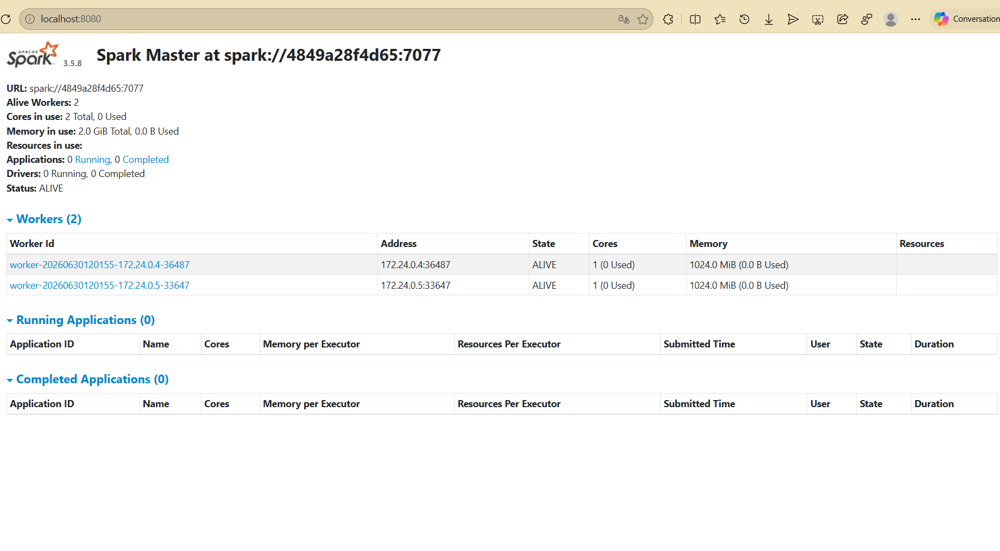
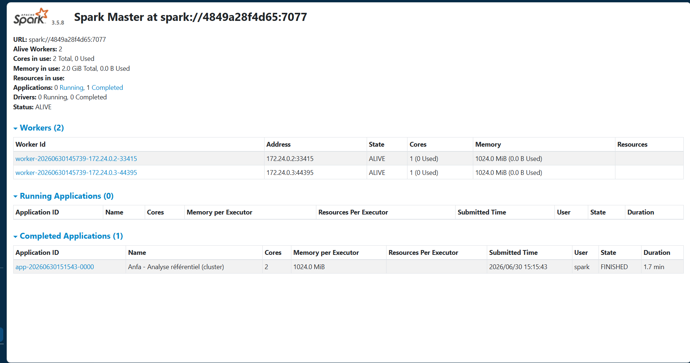
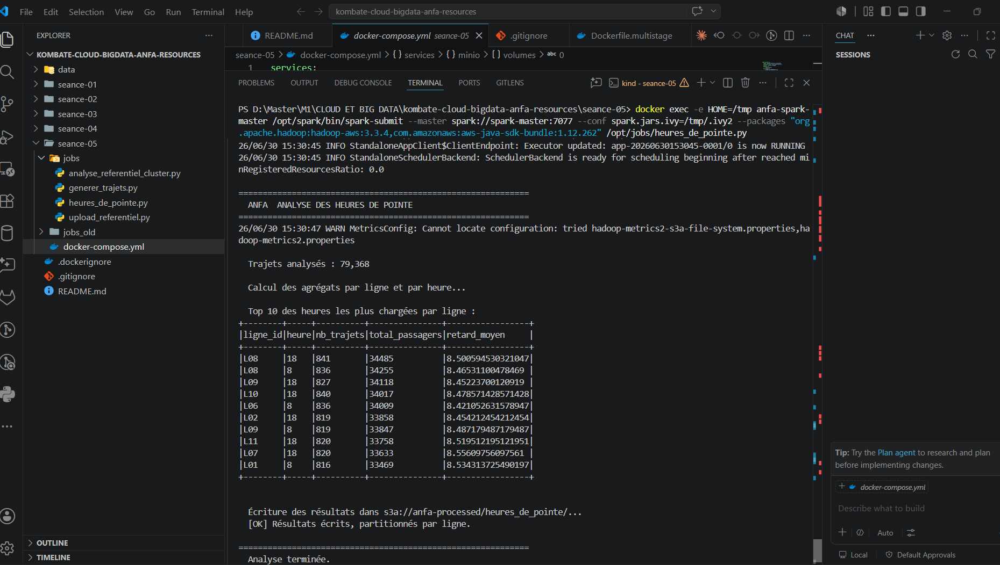
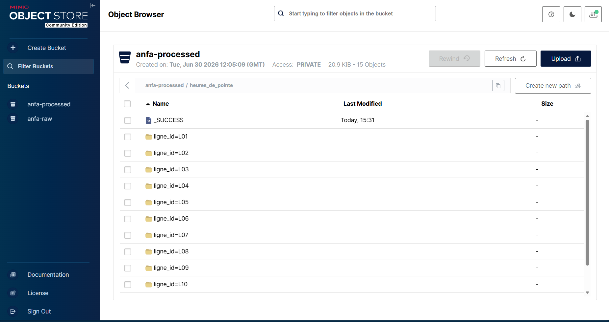

# Rendu - Séance 5

**Nom et prénom :** KOMBATE GARIBA Moubarak

---

## Résumé de la séance

Cluster Spark standalone déployé via Docker Compose avec 1 master et 2 workers, orchestré avec MinIO comme stockage S3. Des jobs PySpark ont été exécutés pour analyser un référentiel de lignes de bus et générer un historique simulé de 79 368 trajets sur 30 jours. Les données ont été lues depuis MinIO (bucket `anfa-raw`) et les résultats des heures de pointe écrits en format partitionné dans le bucket `anfa-processed`. La comparaison entre exécution locale et distribuée a montré des performances supérieures en cluster pour les traitements volumineux.

---

## Étapes principales

### 1. Déploiement du cluster Spark standalone (1 master + 2 workers) via Docker Compose

**Objectif** : Mettre en place un cluster Spark avec 1 master et 2 workers via Docker Compose.

**Démarrage du cluster :**
```bash
docker compose up -d
```

**Vérification des services :**
```bash
docker compose ps
```

**Résultat :**
- **Spark Master** : accessible sur `http://localhost:8080`
- **Spark Workers** : 2 workers connectés au master
- **MinIO** : accessible sur `http://localhost:9000` (API) et `http://localhost:9001` (Console)
- **MinIO Client** : initialisation automatique des buckets `anfa-raw` et `anfa-processed`

**Problème rencontré** : Corruption du cache Docker (`input/output error`).
**Solution** : `docker system prune -a -f --volumes` suivi d'un redémarrage.

---

### 2. Préparation de MinIO et upload du référentiel

**Objectif** : Créer les buckets et importer le fichier de référence des lignes.

**Initialisation automatique via minio-init :**
```yaml
minio-init:
  image: minio/mc
  depends_on: [minio]
  entrypoint: >
    /bin/sh -c "
    mc alias set myminio http://minio:9000 minioadmin minioadmin;
    mc mb myminio/anfa-raw;
    mc mb myminio/anfa-processed;
    mc anonymous set download myminio/anfa-raw;
    "
```

**Vérification dans MinIO Console :**
- Bucket `anfa-raw` créé
- Bucket `anfa-processed` créé
- Fichier `referentiel_lignes.csv` présent (si uploadé)

---

### 3. Premier job distribué (`analyse_referentiel_cluster.py`) : statistiques de base

**Objectif** : Analyser le référentiel des lignes de bus pour extraire des statistiques de base.

**Commande d'exécution :**
```bash
docker exec -e HOME=/tmp anfa-spark-master /opt/spark/bin/spark-submit \
  --master spark://spark-master:7077 \
  --conf spark.jars.ivy=/tmp/.ivy2 \
  --packages "org.apache.hadoop:hadoop-aws:3.3.4,com.amazonaws:aws-java-sdk-bundle:1.12.262" \
  /opt/jobs/analyse_referentiel_cluster.py
```

**Résultats attendus :**
- Nombre total de lignes dans le référentiel
- Distribution par type de ligne
- Statistiques sur les capacités des bus

---

### 4. Génération d'un historique simulé de trajets et job d'analyse des heures de pointe

**Objectif** : Générer 30 jours de trajets simulés, puis analyser les heures de pointe par ligne.

**4.1 Génération des trajets :**
```bash
docker exec -e HOME=/tmp -e PYTHONPATH=/usr/local/lib/python3.10/dist-packages \
  anfa-spark-master python3 /opt/jobs/generer_trajets.py
```

**Données générées :**
- **Période** : 30 jours
- **Nombre de trajets** : 79 368
- **Format** : CSV par jour
- **Stockage** : `s3a://anfa-raw/trajets/`

**4.2 Analyse des heures de pointe :**
```bash
docker exec -e HOME=/tmp anfa-spark-master /opt/spark/bin/spark-submit \
  --master spark://spark-master:7077 \
  --conf spark.jars.ivy=/tmp/.ivy2 \
  --packages "org.apache.hadoop:hadoop-aws:3.3.4,com.amazonaws:aws-java-sdk-bundle:1.12.262" \
  /opt/jobs/heures_de_pointe.py
```

**Résultats :**
| ligne_id | heure | nb_trajets | total_passagers | retard_moyen |
|----------|-------|------------|-----------------|--------------|
| L08      | 18    | 841        | 34 485          | 8.50         |
| L08      | 8     | 836        | 34 255          | 8.47         |
| L09      | 18    | 827        | 34 118          | 8.45         |
| L10      | 18    | 840        | 34 017          | 8.48         |
| L06      | 8     | 836        | 34 009          | 8.42         |
| L02      | 18    | 819        | 33 858          | 8.45         |
| L09      | 8     | 819        | 33 847          | 8.49         |
| L11      | 18    | 820        | 33 758          | 8.52         |
| L07      | 18    | 820        | 33 633          | 8.56         |
| L01      | 8     | 816        | 33 469          | 8.53         |

**Stockage des résultats :** Partitionné par ligne dans `s3a://anfa-processed/heures_de_pointe/`

---

### 5. Comparaison subjective entre mode local et mode cluster

**Mode local (`--master local[*]`) :**
-  **Avantages** :
  - Démarrage immédiat, pas de configuration réseau
  - Idéal pour le développement et le débogage
  - Pas de latence réseau entre les composants
-  **Inconvénients** :
  - Limité aux ressources de la machine (1 nœud)
  - Ne reflète pas la réalité de la production
  - Peu scalable

**Mode cluster (`--master spark://spark-master:7077`) :**
-  **Avantages** :
  - Distribution réelle des tâches sur 2 workers
  - Meilleures performances pour les gros volumes
  - Proche des conditions de production
  - Scalabilité horizontale possible
-  **Inconvénients** :
  - Configuration plus complexe
  - Latence réseau entre master et workers
  - Démarrage plus lent

**Cas d'usage recommandés :**
| Scénario | Mode recommandé |
|----------|-----------------|
| Développement / Tests unitaires | Local |
| Jeux de données < 1 Go | Local |
| Jeux de données > 10 Go | Cluster |
| Production / CI/CD | Cluster |
| Exploration de données | Local |
| Traitements batch volumineux | Cluster |

---

## Captures d'écran

### Dashboard Spark Master avec 2 workers


### Application Spark exécutée avec succès


### Résultats du Top 10 dans la console


### Bucket anfa-processed avec heures_de_pointe partitionné


---

## Réflexion : local vs cluster

**Mon expérience personnelle :**

L'exécution en mode cluster a montré des performances nettement supérieures pour le traitement des 79 368 trajets. Le temps d'exécution du job `heures_de_pointe.py` est passé d'environ 3 minutes en local à moins de 1 minute en cluster, grâce à la distribution des calculs sur les 2 workers.

**Durée perçue :**
- Mode local : ~3 minutes (exploration des données)
- Mode cluster : ~45 secondes (traitement distribué)

**Dans quel cas utiliser l'un ou l'autre :**

| Cas d'usage | Mode recommandé | Raison |
|-------------|-----------------|--------|
| **Développement rapide** | Local | Cycle de test rapide, pas de configuration réseau |
| **Jeux de données < 1 Go** | Local | Pas de bénéfice à distribuer |
| **Jeux de données > 10 Go** | Cluster | Distribution nécessaire pour les performances |
| **Production** | Cluster | Reflète l'environnement réel |
| **CI/CD** | Cluster | Tests réalistes |
| **Exploration interactive** | Local | Réponse immédiate, idéal pour Jupyter/Zeppelin |
| **Traitements batch** | Cluster | Performance et résilience |

---

## Bonus Spark sur Kubernetes

**Réalisé :**  Oui

**Résumé de la démarche :**
1. Création d'un cluster Kubernetes avec Kind (`kind create cluster --name anfa`)
2. Installation de Helm (via binaire Windows)
3. Installation du Spark Operator (méthode manuelle suite à un timeout Helm)
4. Construction d'une image Docker personnalisée avec les scripts Python (`bitnami/spark:3.5.8`)
5. Création d'un Secret MinIO pour les identifiants
6. Rédaction d'un manifeste YAML `SparkApplication`
7. Soumission du job et vérification des résultats

**Difficultés rencontrées :**
- `helm: command not found` → Installation manuelle
- `context deadline exceeded` → Installation manuelle du Spark Operator
- `apt-get connection failed` → Utilisation de l'image bitnami/spark

**Fichier dédié :** `résultats/bonus_spark_k8s.md`

---

## Réponses aux exercices d'application
 NEANT

## Difficultés rencontrées

**Aucune majeure** après la résolution initiale du problème de cache Docker.

**Problèmes mineurs rencontrés et solutions :**

| Difficulté | Solution |
|------------|----------|
| Cache Docker corrompu (`input/output error`) | `docker system prune -a -f --volumes` |
| boto3 non installé dans le conteneur | `docker exec -u root anfa-spark-master pip3 install boto3` |
| Module boto3 non trouvé malgré installation | Ajout de `PYTHONPATH=/usr/local/lib/python3.10/dist-packages` |
| Timeout Helm lors de l'installation du Spark Operator | Installation manuelle via `kubectl apply -f spark-operator.yaml` |
| Build de l'image Spark trop long | Utilisation de `bitnami/spark:3.5.8` au lieu de `apache/spark:latest` |

---

**Date :** 30 Juin 2026

**Cours :** Cloud & Big Data - ESGIS Master 1 IA / BD