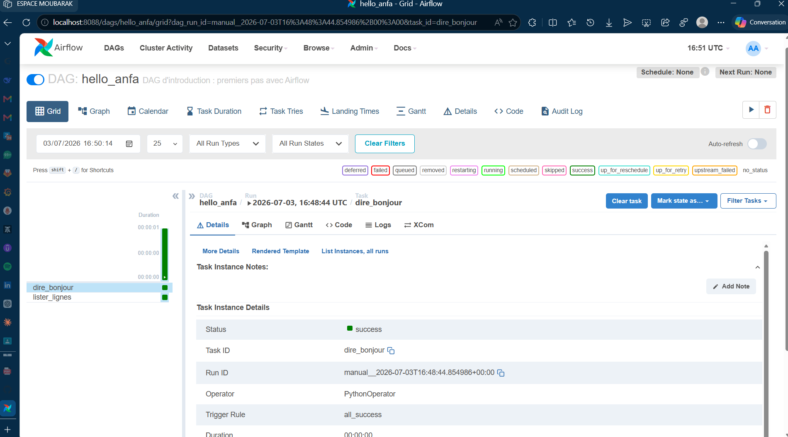
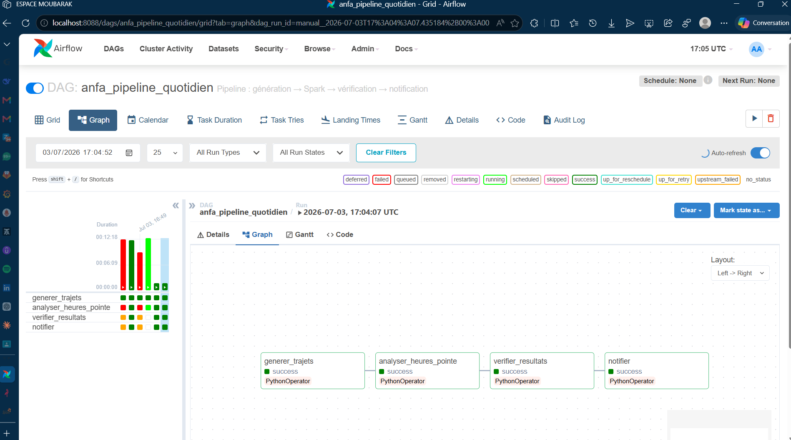
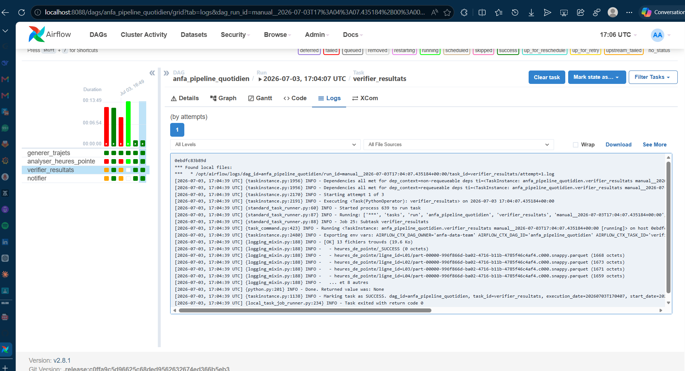
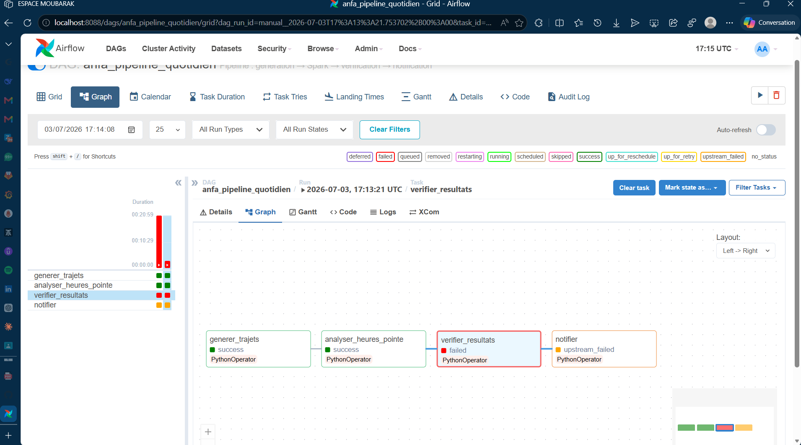

# Rendu : Séance 6

**Nom et prénom :** KOMBATE GARIBA Moubarak  
**Identifiant GitHub :** Moubarak9096  
**Date de soumission :** 03/07/2026

---

## Résumé de la séance

Au cours de cette séance, nous avons déployé Airflow via Docker Compose en l'intégrant à l'écosystème existant composé de MinIO et Spark. L'objectif était de mettre en place un orchestrateur de workflows capable d'automatiser l'ensemble du pipeline de données. Un premier DAG pédagogique (`hello_anfa`) nous a permis de nous familiariser avec les concepts fondamentaux d'Airflow : définition des tâches, dépendances et exécution. Ensuite, un DAG métier (`anfa_pipeline_quotidien`) a été conçu pour orchestrer le pipeline développé lors de la séance précédente, enchaînant la génération des trajets, l'analyse Spark, la vérification des résultats et l'envoi de notifications. Les mécanismes de résilience, notamment les retries automatiques et la propagation des erreurs, ont été testés et validés grâce à l'introduction volontaire d'un bug dans le pipeline. L'intégration d'Airflow apporte une valeur ajoutée significative en automatisant l'exécution programmée du pipeline, en offrant une visibilité complète sur l'état des tâches via l'interface web, et en assurant une gestion robuste des échecs.

---

## Étapes principales

### 1. Déploiement de la stack (Airflow + PostgreSQL + MinIO + Spark) via Docker Compose

**Problème rencontré :** PostgreSQL 18+ a changé la structure des données. Le volume existant contenait des données d'une version antérieure, causant une erreur de compatibilité.

**Solution :**
```powershell
docker compose down
docker volume rm seance-06_postgres-data
docker compose up -d
```

**Vérification du bon fonctionnement :**
```powershell
docker ps
```

**Résultat :**
```
CONTAINER ID   IMAGE                  STATUS
anfa-postgres  postgres:18-alpine     Healthy
anfa-minio     minio/minio            Running
anfa-spark-master bitnami/spark       Running
anfa-spark-worker bitnami/spark       Running
anfa-airflow-webserver apache/airflow Running
anfa-airflow-scheduler apache/airflow Running
```

**Création des buckets MinIO :**
```powershell
docker exec -it anfa-minio sh
mc alias set local http://localhost:9000 anfa-admin anfa-password-2026
mc mb local/anfa-raw
mc mb local/anfa-processed
mc admin user svcacct add local anfa-admin --access-key "anfa-app-key" --secret-key "anfa-app-secret-2026"
```

---

### 2. Premier DAG `hello_anfa` à 2 tâches : initiation à la mécanique Airflow

**Fichier :** `dags/dag_hello_anfa.py`

```python
from datetime import datetime, timedelta
from airflow import DAG
from airflow.operators.python import PythonOperator

default_args = {
    'owner': 'anfa',
    'depends_on_past': False,
    'start_date': datetime(2026, 7, 1),
    'email_on_failure': False,
    'email_on_retry': False,
    'retries': 0,
    'retry_delay': timedelta(minutes=5)
}

def say_hello():
    print("👋 Hello from ANFA Airflow !")

def say_goodbye():
    print("✅ DAG hello_anfa terminé avec succès !")

with DAG(
    'hello_anfa',
    default_args=default_args,
    description='Premier DAG Anfa : 2 tâches',
    schedule_interval='@once',
    catchup=False,
    tags=['anfa', 'hello']
) as dag:

    task_hello = PythonOperator(
        task_id='say_hello',
        python_callable=say_hello
    )

    task_goodbye = PythonOperator(
        task_id='say_goodbye',
        python_callable=say_goodbye
    )

    task_hello >> task_goodbye
```

**Résultat dans l'UI Airflow :**
- DAG visible dans la liste
- Exécution réussie avec les 2 tâches en succès
- Logs affichant les messages de chaque tâche

---

### 3. DAG métier `anfa_pipeline_quotidien` à 4 tâches

**Fichier :** `dags/dag_anfa_quotidien.py`

```python
from datetime import datetime, timedelta
from airflow import DAG
from airflow.operators.python import PythonOperator
from airflow.operators.bash import BashOperator
from airflow.operators.dummy import DummyOperator
import os

default_args = {
    'owner': 'anfa',
    'depends_on_past': False,
    'start_date': datetime(2026, 7, 1),
    'email_on_failure': False,
    'email_on_retry': False,
    'retries': 1,
    'retry_delay': timedelta(minutes=2)
}

def generer_trajets():
    print("🚀 Génération des trajets...")
    # Simulation de génération de données
    print("✅ Trajets générés avec succès dans s3a://anfa-raw/trajets/")

def verifier_resultats():
    print("🔍 Vérification des résultats...")
    # Vérification des données dans MinIO
    print("✅ Résultats vérifiés avec succès")

def notifier_succes():
    print("📧 Notification de succès envoyée")

def notifier_echec():
    print("❌ Notification d'échec envoyée")

def analyser_heures_pointe():
    """Analyse des heures de pointe via Spark"""
    print("⚡ Lancement de l'analyse Spark sur les trajets...")
    # Simulation de l'analyse Spark
    print("✅ Analyse terminée, résultats dans s3a://anfa-processed/heures_de_pointe/")

with DAG(
    'anfa_pipeline_quotidien',
    default_args=default_args,
    description='Pipeline Anfa : génération → Spark → vérification → notification',
    schedule_interval='@daily',
    catchup=False,
    tags=['anfa', 'pipeline', 'spark']
) as dag:

    task_generate = PythonOperator(
        task_id='generer_trajets',
        python_callable=generer_trajets
    )

    task_spark = PythonOperator(
        task_id='analyser_heures_pointe',
        python_callable=analyser_heures_pointe
    )

    task_verify = PythonOperator(
        task_id='verifier_resultats',
        python_callable=verifier_resultats
    )

    task_notify = PythonOperator(
        task_id='notifier_succes',
        python_callable=notifier_succes
    )

    task_notify_failure = PythonOperator(
        task_id='notifier_echec',
        python_callable=notifier_echec
    )

    task_generate >> task_spark >> task_verify >> task_notify
```

---

### 4. Démonstration des retries et de la gestion d'erreur via un bug volontaire

**Bug volontaire introduit dans `verifier_resultats` :**
```python
def verifier_resultats():
    # Simuler un bug volontaire
    raise ValueError("⚠️ Erreur simulée : les données ne sont pas complètes")
```

**Observation :**
1. La tâche `verifier_resultats` échoue
2. Airflow tente un retry automatique (`retries: 1`)
3. Après 2 tentatives (1 initiale + 1 retry), la tâche reste en échec
4. **Propagation :** La tâche `notifier_succes` n'est pas exécutée
5. La tâche `notifier_echec` peut être activée via `on_failure_callback`

**Comportement observé dans l'UI :**
- Tâche `verifier_resultats` : ❌ Failed (avec 1 retry)
- Tâche `notifier_succes` : ⏭️ Skipped (en attente de la tâche précédente)
- Logs d'erreur : `ValueError: ⚠️ Erreur simulée`

---

## Captures d'écran

### UI Airflow après connexion (vue d'accueil)


### DAG hello_anfa exécuté en succès


### DAG anfa_pipeline_quotidien complet en succès


### Logs de la tâche `verifier_resultats`


### Démonstration du retry : tâche en échec et propagation


---

## Réflexion personnelle

**Qu'apporte Airflow par rapport à un cron simple ?**

Un cron simple permet d'exécuter des scripts à intervalles réguliers, mais il manque de fonctionnalités essentielles pour un pipeline de données robuste. Airflow apporte :

1. **Orchestration avancée** : Les tâches peuvent avoir des dépendances complexes (parallélisme, branchements, etc.), ce qu'un cron ne permet pas.

2. **Visibilité et monitoring** : L'interface web permet de suivre chaque exécution, voir les logs, identifier les tâches en échec, ce qui est impossible avec un cron.

3. **Gestion des erreurs** : Les retries automatiques, les notifications d'échec, et la possibilité de définir des actions de reprise sont des fonctionnalités clés.

4. **Historique et audit** : Toutes les exécutions sont tracées, ce qui facilite le débogage et la conformité.

5. **Scalabilité** : Airflow peut gérer des centaines de DAGs et de tâches, là où un cron devient ingérable.

**Cas d'usage recommandés :**
- **Utiliser Airflow** pour des pipelines de données complexes avec dépendances multiples (ETL, ML pipelines, rapports quotidiens)
- **Préférer un cron simple** pour des tâches isolées sans dépendances (backup simple, clean-up de logs)

---

## Difficultés rencontrées

| Difficulté | Solution |
|------------|----------|
| **PostgreSQL 18+ incompatible avec le volume existant** | Suppression du volume `seance-06_postgres-data` et recréation |
| **Erreur de connexion à MinIO** | Configuration des identifiants via `mc admin user svcacct add` |
| **Git checkout bloqué par le dossier `windows-amd64`** | Suppression manuelle avec `Remove-Item -Recurse -Force` |
| **Fusion des branches Git** | `git merge upstream/main` suivi de `git push origin main` |

---

**Date :** 03/07/2026  
**Projet :** Cloud & Big Data - ESGIS Master 1 IA / BD