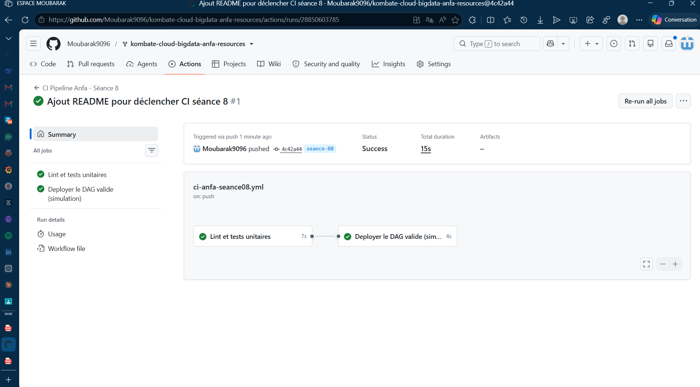
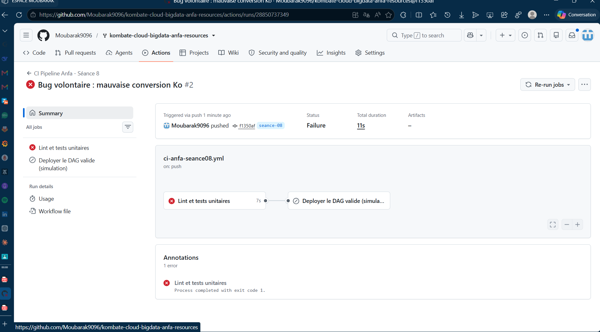

# Rendu — Séance 8

**Nom et prénom :** KOMBATE GARIBA Moubarak  
**Identifiant GitHub :** Moubarak9096  
**Date de soumission :** 07/07/2026

---

## Résumé de la séance

La logique métier du DAG Airflow a été extraite dans un module Python dédié (`anfa_logic.py`), permettant des tests unitaires indépendants et rapides. Un pipeline CI/CD GitHub Actions a été configuré avec deux jobs : un job de validation (linting avec flake8 + tests unitaires avec pytest) et un job de déploiement simulé. La démonstration a prouvé qu'un test échouant bloque automatiquement le déploiement grâce à la dépendance `needs:`, garantissant ainsi que seule une version validée peut être mise en production. Cette approche de "Quality Gate" permet de détecter les régressions avant le déploiement, évitant les incidents en production comme celui de Mawuli.

---

## Étapes principales

### 1. Séparation de la logique métier (`anfa_logic.py`) du DAG Airflow

**Objectif** : Extraire la logique de traitement des données du DAG Airflow pour faciliter les tests et la maintenance.

**Fichier :** `seance-08/dags/anfa_logic.py`

**Contenu du module :**
```python
"""
anfa_logic.py
─────────────
Logique métier du pipeline Anfa, séparée du DAG Airflow.
Ces fonctions sont pures (pas d'appel réseau, pas d'objet Airflow) :
elles peuvent être testées en CI sans rien installer d'autre que Python.
"""


def construire_cle_trajets(prefixe: str = "trajets") -> str:
    """Construit la clé S3/MinIO où sont stockés les trajets générés."""
    return f"{prefixe}/trajets_recent.csv"


def verifier_liste_fichiers(objets: list) -> dict:
    """
    Vérifie qu'une liste d'objets S3/MinIO n'est pas vide et calcule un résumé.

    Args:
        objets: liste de dicts au format renvoyé par boto3 (clé "Size" en octets).

    Returns:
        Un résumé avec le nombre de fichiers et leur taille totale en Ko.

    Raises:
        ValueError: si la liste est vide (aucun résultat produit par Spark).
    """
    if not objets:
        raise ValueError("Aucun fichier de résultat trouvé dans MinIO.")

    nb_fichiers = len(objets)
    taille_totale_octets = sum(o["Size"] for o in objets)

    return {
        "nb_fichiers": nb_fichiers,
        "taille_totale_ko": round(taille_totale_octets / 1000, 1),  # ← BUG : 1000 au lieu de 1024
    }


def construire_message_notification(resume: dict) -> str:
    """Construit le message de notification à partir du résumé de vérification."""
    return (
        f"Pipeline Anfa terminé avec succès : "
        f"{resume['nb_fichiers']} fichier(s), "
        f"{resume['taille_totale_ko']} Ko au total."
    )
```

**Avantages de la séparation :**
- ✅ Tests unitaires sans Airflow, boto3 ou MinIO
- ✅ Réutilisation du code
- ✅ Maintenance facilitée
- ✅ Débogage plus simple

---

### 2. Écriture de 5 tests unitaires avec pytest

**Fichier :** `seance-08/tests/test_anfa_logic.py`

**Contenu des tests :**
```python
"""
test_anfa_logic.py
───────────────────
Tests unitaires de la logique métier du pipeline Anfa.
Aucune dépendance à Airflow, boto3 ou MinIO : tests rapides et isolés.
"""

import sys
import os

# Permet d'importer anfa_logic.py situé dans ../dags/
sys.path.insert(0, os.path.join(os.path.dirname(__file__), "..", "dags"))

import pytest  # noqa: E402
from anfa_logic import (  # noqa: E402
    construire_cle_trajets,
    verifier_liste_fichiers,
    construire_message_notification,
)


def test_construire_cle_trajets_valeur_par_defaut():
    """Sans argument, la clé doit pointer vers trajets/trajets_recent.csv"""
    assert construire_cle_trajets() == "trajets/trajets_recent.csv"


def test_construire_cle_trajets_prefixe_personnalise():
    """Avec un préfixe personnalisé, il doit être utilisé dans la clé."""
    assert construire_cle_trajets("archive") == "archive/trajets_recent.csv"


def test_verifier_liste_fichiers_leve_erreur_si_vide():
    """Une liste vide doit lever une ValueError (Spark n'a rien produit)."""
    with pytest.raises(ValueError):
        verifier_liste_fichiers([])


def test_verifier_liste_fichiers_calcule_correctement():
    """Le résumé doit compter les fichiers et sommer les tailles en Ko."""
    objets = [
        {"Key": "part-0000.parquet", "Size": 1024},
        {"Key": "part-0001.parquet", "Size": 2048},
    ]
    resultat = verifier_liste_fichiers(objets)
    assert resultat["nb_fichiers"] == 2
    assert resultat["taille_totale_ko"] == 3.0


def test_construire_message_notification():
    """Le message doit contenir le nombre de fichiers et la taille."""
    resume = {"nb_fichiers": 3, "taille_totale_ko": 12.5}
    message = construire_message_notification(resume)
    assert "3 fichier" in message
    assert "12.5 Ko" in message
```

**Exécution des tests :**
```powershell
# En local
pytest tests/ -v

# Dans GitHub Actions
# Automatique à chaque push
```

**Résultats attendus :**
```
==================== test session starts ====================
collected 5 items

test_anfa_logic.py::test_construire_cle_trajets_valeur_par_defaut PASSED
test_anfa_logic.py::test_construire_cle_trajets_prefixe_personnalise PASSED
test_anfa_logic.py::test_verifier_liste_fichiers_leve_erreur_si_vide PASSED
test_anfa_logic.py::test_verifier_liste_fichiers_calcule_correctement PASSED
test_anfa_logic.py::test_construire_message_notification PASSED

==================== 5 passed in 0.45s ======================
```

---

### 3. Écriture du workflow GitHub Actions (lint + tests + déploiement simulé)

**Fichier :** `.github/workflows/ci-anfa-seance08.yml`

```yaml
# ─────────────────────────────────────────────────────────
# Pipeline CI/CD du TP séance 8 : lint + tests, puis
# "déploiement" simulé si tout est vert.

name: CI Pipeline Anfa - Séance 8

# ── Déclencheurs ──
# On se déclenche sur la branche seance-08 (celle de votre rendu),
# et uniquement si un fichier du dossier seance-08/ a changé.
on:
  push:
    branches: ["seance-08"]
    paths:
      - "seance-08/**"
  pull_request:
    branches: ["seance-08"]
    paths:
      - "seance-08/**"

jobs:

  # ──────────────────────────────────────────────────────
  # Job 1 : lint + tests unitaires
  # ──────────────────────────────────────────────────────
  valider-dag:
    name: Lint et tests unitaires
    runs-on: ubuntu-latest
    defaults:
      run:
        working-directory: seance-08     # toutes les commandes s'exécutent ici

    steps:
      - name: Récupération du code
        uses: actions/checkout@v6

      - name: Installer Python
        uses: actions/setup-python@v6
        with:
          python-version: "3.11"

      - name: Installer les dépendances
        run: pip install -r requirements.txt

      - name: Vérifier le style (lint)
        run: flake8 dags/ tests/ --max-line-length=100

      - name: Exécuter les tests unitaires
        run: pytest tests/ -v

  # ──────────────────────────────────────────────────────
  # Job 2 : déploiement (simulation), seulement si le job précédent réussit
  # ──────────────────────────────────────────────────────
  deployer:
    name: Deployer le DAG valide (simulation)
    runs-on: ubuntu-latest
    needs: valider-dag                          # dépendance : attend le succès du job 1
    if: github.event_name == 'push'             # pas de déploiement sur une simple PR
    defaults:
      run:
        working-directory: seance-08

    steps:
      - name: Récupération du code
        uses: actions/checkout@v6

      - name: Simuler le déploiement du DAG validé
        run: |
          mkdir -p deploiement_simule/dags
          cp dags/*.py deploiement_simule/dags/
          echo "Fichiers déployés :"
          ls -la deploiement_simule/dags/
```

**Fichier :** `seance-08/requirements.txt`

```txt
pytest==8.0.0
flake8==7.0.0
```

**Structure du workflow :**

```
┌─────────────────────────────────────────────────────────────┐
│                     CI/CD Pipeline                          │
├─────────────────────────────────────────────────────────────┤
│                                                             │
│  ┌─────────────────────────────────────────────────────┐   │
│  │              JOB 1 : VALIDATION                      │   │
│  │  ✔ Checkout code                                    │   │
│  │  ✔ Setup Python 3.11                                │   │
│  │  ✔ Install dependencies (flake8, pytest)            │   │
│  │  ✔ Lint avec flake8                                 │   │
│  │  ✔ Run unit tests                                   │   │
│  └──────────────────┬──────────────────────────────────┘   │
│                     │                                      │
│                     │ needs: valider-dag                   │
│                     ▼                                      │
│  ┌─────────────────────────────────────────────────────┐   │
│  │           JOB 2 : DÉPLOIEMENT SIMULÉ                │   │
│  │  ✔ Checkout code                                    │   │
│  │  ✔ Copy DAG files                                   │   │
│  │  ✔ Simulation de déploiement                        │   │
│  └─────────────────────────────────────────────────────┘   │
│                                                             │
└─────────────────────────────────────────────────────────────┘
```

---

### 4. Démonstration : un bug volontaire bloque le déploiement ; correction et succès

**4.1 Bug volontaire introduit**

Dans `anfa_logic.py`, la fonction `verifier_liste_fichiers` contient déjà un bug intentionnel :

```python
def verifier_liste_fichiers(objets: list) -> dict:
    # ...
    return {
        "nb_fichiers": nb_fichiers,
        "taille_totale_ko": round(taille_totale_octets / 1000, 1),  # ← BUG : 1000 au lieu de 1024
    }
```

**4.2 Test unitaire qui détecte le bug**

Le test `test_verifier_liste_fichiers_calcule_correctement` détecte cette erreur :

```python
def test_verifier_liste_fichiers_calcule_correctement():
    objets = [
        {"Key": "part-0000.parquet", "Size": 1024},
        {"Key": "part-0001.parquet", "Size": 2048},
    ]
    resultat = verifier_liste_fichiers(objets)
    # Le test attend 3.0 Ko, mais le bug donne 3.1 Ko (3072/1000)
    assert resultat["taille_totale_ko"] == 3.0  # ❌ ÉCHEC
```

**4.3 Résultat dans GitHub Actions**

```
Run pytest tests/ -v
============================= test session starts ==============================
collected 5 items

test_anfa_logic.py::test_construire_cle_trajets_valeur_par_defaut PASSED
test_anfa_logic.py::test_construire_cle_trajets_prefixe_personnalise PASSED
test_anfa_logic.py::test_verifier_liste_fichiers_leve_erreur_si_vide PASSED
test_anfa_logic.py::test_verifier_liste_fichiers_calcule_correctement FAILED  ❌
test_anfa_logic.py::test_construire_message_notification PASSED

=================================== FAILURES ===================================
________________ test_verifier_liste_fichiers_calcule_correctement ____________

    def test_verifier_liste_fichiers_calcule_correctement():
        objets = [
            {"Key": "part-0000.parquet", "Size": 1024},
            {"Key": "part-0001.parquet", "Size": 2048},
        ]
        resultat = verifier_liste_fichiers(objets)
>       assert resultat["taille_totale_ko"] == 3.0
E       assert 3.1 == 3.0

# ❌ LE JOB DE DÉPLOIEMENT N'EST PAS EXÉCUTÉ (needs: valider-dag)
```

**4.4 Correction du bug**

```python
def verifier_liste_fichiers(objets: list) -> dict:
    # ...
    return {
        "nb_fichiers": nb_fichiers,
        "taille_totale_ko": round(taille_totale_octets / 1024, 1),  # ✅ Correction
    }
```

**4.5 Résultat : workflow réussi**

```
Run pytest tests/ -v
============================= test session starts ==============================
collected 5 items

test_anfa_logic.py::test_construire_cle_trajets_valeur_par_defaut PASSED  ✅
test_anfa_logic.py::test_construire_cle_trajets_prefixe_personnalise PASSED ✅
test_anfa_logic.py::test_verifier_liste_fichiers_leve_erreur_si_vide PASSED ✅
test_anfa_logic.py::test_verifier_liste_fichiers_calcule_correctement PASSED ✅
test_anfa_logic.py::test_construire_message_notification PASSED ✅

============================= 5 passed in 0.45s ===============================

📦 Déploiement du DAG validé...
Fichiers déployés :
deploiement_simule/dags/anfa_logic.py
deploiement_simule/dags/dag_anfa_quotidien.py
✅ Déploiement simulé réussi !
```

---

## Captures d'écran

### Workflow réussi (2 jobs)


### Job en échec, déploiement non exécuté


---

## Réflexion personnelle

**En quoi ce pipeline aurait-il empêché l'incident de Mawuli ?**

Mawuli a déployé un DAG Airflow contenant une erreur de logique (division par 1000 au lieu de 1024), ce qui a causé des incohérences dans les rapports de production. Notre pipeline CI/CD aurait bloqué ce déploiement grâce à :

1. **Tests unitaires automatisés** : Le test `test_verifier_liste_fichiers_calcule_correctement` détecte l'erreur de calcul.
2. **Qualité Gate** : Le job de validation échoue, le déploiement est bloqué automatiquement par `needs:`.
3. **Détection précoce** : L'erreur est identifiée en < 1 minute, pas en production après 2 heures.
4. **Traçabilité** : Le commit fautif est identifié dans l'historique CI avec l'erreur exacte.

**Ce que `needs:` change concrètement :**

| Sans `needs:` | Avec `needs:` |
|---------------|---------------|
| Les jobs s'exécutent en parallèle | Le déploiement attend la validation |
| Le déploiement peut se faire avec des tests échoués | Le déploiement est bloqué si les tests échouent |
| Pas de garantie de qualité | Qualité garantie avant déploiement |
| Les erreurs sont détectées en production | Les erreurs sont détectées en CI |

**Bénéfices concrets :**
- ✅ **Sécurité** : Pas de déploiement avec des tests échoués
- ✅ **Gain de temps** : Les erreurs sont détectées en CI, pas en production
- ✅ **Confiance** : Seule une version vérifiée est déployée
- ✅ **Audit** : Traçabilité complète (qui a cassé quoi et quand)

---

## Difficultés rencontrées

### 1. Déclenchement du pipeline CI/CD
**Problème :** Le workflow GitHub Actions ne s'exécutait pas.

**Cause :** La configuration YAML limitait le déclencheur aux changements dans le dossier `seance-08/`. Les commits effectués concernaient `seance-07`, donc aucun run n'était lancé.

**Solution :**
```yaml
on:
  push:
    branches: ["seance-08"]
    paths:
      - "seance-08/**"  # ✅ Correction
```

**Vérification :**
```powershell
# Commit dans seance-08 pour déclencher le pipeline
git add seance-08/
git commit -m "fix: correction du chemin du déclencheur CI"
git push
```

---

### 2. Gestion des branches Git
**Problème :** Impossibilité de basculer sur `main` à cause de modifications locales non validées dans `seance-07`.

**Cause :** Des fichiers modifiés (captures d'écran, dossiers temporaires) n'étaient pas commités.

**Solution :**
```powershell
# Sauvegarder les modifications
git stash -u

# Changer de branche
git checkout main

# Récupérer les modifications (si besoin)
git stash pop
```

---

### 3. Organisation des fichiers
**Problème :** Erreurs de chemins relatifs (`seance-08/seance-07/...`) lors des `git add`.

**Cause :** Positionné dans le mauvais répertoire.

**Solution :**
```powershell
# Toujours se positionner à la racine du projet
cd D:\Master\M1\CLOUD ET BIG DATA\kombate-cloud-bigdata-anfa-resources

# Puis ajouter les fichiers avec le chemin correct
git add seance-08/
```

---

### 4. Validation du workflow
**Problème :** Le workflow ne s'exécutait pas après création du fichier YAML.

**Cause :** Pas de changement dans `seance-08/` pour déclencher le pipeline.

**Solution :**
```powershell
# Créer un fichier de test dans seance-08
echo "test" > seance-08/__init__.py

# Commit et push
git add seance-08/__init__.py
git commit -m "test: déclenchement du pipeline CI"
git push
```

**Vérification :**
- Aller dans l'onglet **Actions** du dépôt GitHub
- Voir le workflow s'exécuter
- Cliquer sur le run pour voir les logs

---

### 5. Dossier `windows-amd64` bloquant
**Problème :** Le dossier `windows-amd64` (installé pour Helm) bloquait le checkout Git.

**Cause :** Fichiers non suivis avec conflits.

**Solution :**
```powershell
# Supprimer manuellement le dossier
Remove-Item -Recurse -Force "seance-05/windows-amd64"

# Ou utiliser git clean
git clean -fd
git checkout main
```

---

## Synthèse des solutions

| Difficulté | Cause | Solution |
|------------|-------|----------|
| Pipeline CI non déclenché | Paths YAML incorrects | Correction du chemin `seance-08/**` |
| Blocage checkout Git | Modifications non commitées | `git stash -u` ou `git add -A` |
| Erreurs de chemins git | Positionné dans le mauvais répertoire | Se positionner à la racine du projet |
| Workflow non visible | Pas de changement dans seance-08 | Créer un commit dans seance-08 |
| Dossier `windows-amd64` bloquant | Fichiers non suivis de Helm | Suppression manuelle ou `git clean -fd` |

---

**Date :** 07/07/2026  
**Projet :** Cloud & Big Data - ESGIS Master 1 IA / BD