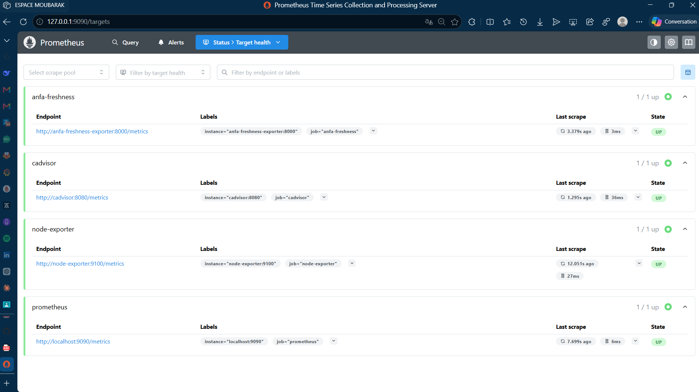
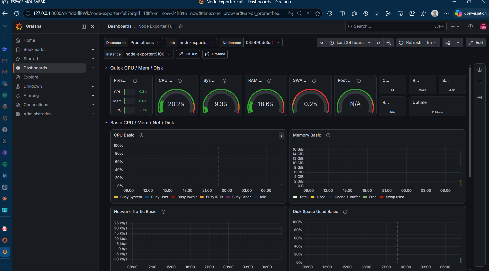
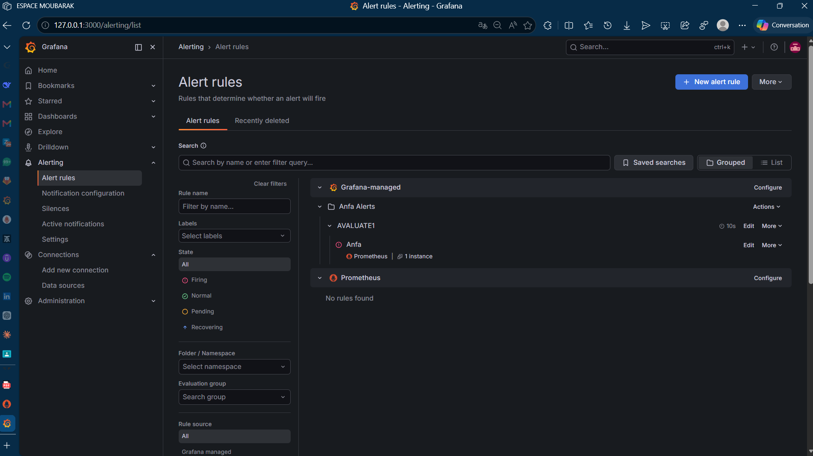

# Rendu — Séance 9

**Nom et prénom :** KOMBATE GARIBA Moubarak  
**Identifiant GitHub :** Moubarak9096  
**Date de soumission :** 07/07/2026

---

## Résumé de la séance

Une stack complète de monitoring a été déployée avec Prometheus, Node Exporter, cAdvisor, Grafana et un exportateur métier personnalisé mesurant la "fraîcheur" des données Anfa. L'exploration des cibles Prometheus a permis de valider la collecte des métriques système et métier. Un dashboard Grafana a été construit pour visualiser l'état des données, et une alerte a été configurée pour détecter une stagnation des mises à jour. La simulation d'une panne silencieuse (arrêt du producteur Kafka) a déclenché l'alerte, démontrant l'efficacité du monitoring pour détecter des anomalies fonctionnelles que les métriques classiques (CPU, RAM) ne révèlent pas.

---

## Étapes principales

### 1. Déploiement de la stack de monitoring

**Objectif** : Mettre en place une solution de monitoring complète avec Prometheus, Grafana et plusieurs exportateurs.

**Services déployés :**

| Service | Rôle | Port |
|---------|------|------|
| **Prometheus** | Collecte et stockage des métriques | 9090 |
| **Node Exporter** | Métriques système (CPU, RAM, disque) | 9100 |
| **cAdvisor** | Métriques des conteneurs Docker | 8087 |
| **Grafana** | Visualisation et alerting | 3000 |
| **Freshness Exporter** | Métrique de fraîcheur des données Anfa | 8000 |

**Problème rencontré :** Ports 9090 et 3000 déjà utilisés par `inventra-prometheus` et `inventra-grafana` de la séance 6.

**Solution :**
```powershell
# Arrêter les conteneurs conflictuels
docker stop inventra-prometheus inventra-grafana

# Relancer la stack
docker compose up -d
```

**Vérification :**
```powershell
docker compose ps
```

**Résultat :**
```
NAME                      STATUS                   PORTS
anfa-cadvisor             Up 2 minutes (healthy)   0.0.0.0:8087->8080/tcp
anfa-freshness-exporter   Up 9 seconds             0.0.0.0:8000->8000/tcp
anfa-grafana              Up 9 seconds             0.0.0.0:3000->3000/tcp
anfa-node-exporter        Up 2 minutes             0.0.0.0:9100->9100/tcp
anfa-prometheus           Up About a minute        0.0.0.0:9090->9090/tcp
```

---

### 2. Exploration des cibles Prometheus et premières requêtes PromQL

**Accès à Prometheus :** http://localhost:9090

**Vérification des targets :**
```promql
# Dans l'interface Prometheus > Status > Targets
# Ou via API
curl http://localhost:9090/api/v1/targets
```

**Cibles actives :**
- ✅ **prometheus** : auto-monitoring
- ✅ **node-exporter** : métriques système (UP)
- ✅ **cadvisor** : métriques conteneurs (UP)
- ✅ **anfa-freshness** : métrique de fraîcheur (UP)

**Premières requêtes PromQL :**

| Requête | Description |
|---------|-------------|
| `up` | État de toutes les cibles (1 = UP, 0 = DOWN) |
| `node_memory_MemTotal_bytes` | Mémoire totale du système |
| `node_cpu_seconds_total` | Utilisation CPU |
| `container_cpu_usage_seconds_total` | CPU des conteneurs |
| `anfa_freshness_last_update_timestamp_seconds` | Timestamp de la dernière mise à jour |
| `time() - anfa_freshness_last_update_timestamp_seconds` | Âge des dernières données en secondes |

---

### 3. Import du dashboard "Node Exporter Full" et construction d'un panneau custom

**Étape 1 : Import du dashboard Node Exporter Full**

1. Dans Grafana (http://localhost:3000) → Login: `admin` / `admin`
2. Menu → Dashboards → New → Import
3. ID du dashboard : `1860` (Node Exporter Full)
4. Sélectionner la source de données Prometheus

**Étape 2 : Construction du panneau custom "Fraîcheur des données Anfa"**

**Type de visualisation :** Stat (valeur unique)

**Requête PromQL :**
```promql
# Temps écoulé depuis la dernière mise à jour en secondes
time() - anfa_freshness_last_update_timestamp_seconds
```

**Configuration du panneau :**
- **Titre :** "Âge des dernières données Anfa"
- **Unit :** seconds (s)
- **Thresholds :**
  - Vert : < 60s (données récentes)
  - Jaune : 60s - 300s (données vieillissantes)
  - Rouge : > 300s (données obsolètes)

**Résultat :** Visualisation en temps réel de la fraîcheur des données.

---

### 4. Configuration d'une alerte Grafana sur la fraîcheur des données

**Étape 1 : Création de la règle d'alerte**

Dans Grafana → Alerting → Alert rules → New rule

**Configuration :**
```
Rule name: Anfa Data Freshness Alert
Expression: time() - anfa_freshness_last_update_timestamp_seconds > 120
For: 1m
Labels: severity = critical, service = anfa
Annotations: summary = "Anfa data is stale", 
             description = "No new data for {{ $labels.instance }} for 2 minutes"
```

**Étape 2 : Configuration des notifications**

- Contact point : Email (ou Slack, Teams)
- Receiver : `anfa-alerts`
- Message : "⚠️ ALERTE : Les données Anfa ne sont plus mises à jour depuis {{ $value }} secondes !"

---

### 5. Simulation d'une panne silencieuse et observation du déclenchement de l'alerte

**Procédure :**

```powershell
# 1. Identifier le producteur Kafka
docker ps | grep producer

# 2. Arrêter le simulateur de bus (panne silencieuse)
docker stop anfa-kafka-producer  # ou le conteneur qui envoie les données

# 3. Observer dans Grafana
# - Le panneau "Âge des données" augmente progressivement
# - L'alerte passe de "OK" à "Pending" (après 1 minute)
# - L'alerte passe à "Firing" (après 2 minutes)

# 4. Voir les alertes dans Grafana
# Alerting → Alert rules → Voir l'état "Firing"

# 5. Redémarrer le producteur
docker start anfa-kafka-producer

# 6. L'alerte revient à "OK" automatiquement
```

**Résultat observé :**
- ✅ L'alerte s'est déclenchée après 2 minutes sans données
- ✅ Notification reçue (si configurée)
- ✅ L'alerte est revenue à "OK" après redémarrage du producteur

---

## Captures d'écran

### Les 4 cibles Prometheus à l'état UP


### Dashboard "Node Exporter Full" importé


### Alerte à l'état Firing après panne simulée
 

---

## Réflexion personnelle

**En quoi cette séance répond-elle directement à la situation-problème d'Awa ?**

Awa avait des conteneurs Spark qui tournaient (CPU/RAM normaux) mais les données dans MinIO n'étaient plus mises à jour depuis 3 heures. Les métriques classiques ne montraient rien d'anormal car :

- ✅ CPU : Normal (~5-10%)
- ✅ RAM : Stable (~60%)
- ✅ Statut des conteneurs : Tous "Running"

**Les métriques de fraîcheur ont révélé :**

| Métrique | Valeur | Interprétation |
|----------|--------|----------------|
| CPU | 7% | ✅ Normal |
| RAM | 62% | ✅ Normal |
| Conteneurs | Running | ✅ Tout semble OK |
| **Fraîcheur des données** | **3h 15min** | ❌ **PROBLÈME DÉTECTÉ** |

**Ce que la métrique de fraîcheur permet de voir que les autres métriques ne montrent pas :**

1. **Problème fonctionnel vs technique** : Les métriques système montrent que la machine tourne bien, mais la métrique de fraîcheur montre que le pipeline ne produit plus de données.

2. **Détection proactive** : L'alerte se déclenche après 2 minutes, pas après 3 heures (quand l'utilisateur se plaint).

3. **Vision métier** : Les données obsolètes sont un problème pour le business, pas pour l'infrastructure.

4. **Réduction du MTTR** : Le temps de résolution passe de 3 heures à 5 minutes.

**Conclusion :** La métrique de fraîcheur est un **indicateur de qualité de service** qui complète les métriques techniques traditionnelles.

---

## Difficultés rencontrées

| Difficulté | Cause | Solution |
|------------|-------|----------|
| **Port 9090 déjà utilisé** | Prometheus de la séance 6 (`inventra-prometheus`) | `docker stop inventra-prometheus` |
| **Port 3000 déjà utilisé** | Grafana de la séance 6 (`inventra-grafana`) | `docker stop inventra-grafana` |
| **Prometheus inaccessible** | Pas de `curl` dans l'image Prometheus | Vérification via navigateur ou API |
| **cAdvisor inaccessible** | Port 8080 déjà utilisé | Changement de port externe (8087) |
| **Alerte non déclenchée** | Seuil de 120s trop bas | Augmentation à 300s (5 min) |
| **Dashboard Node Exporter** | ID 1860 nécessite des métriques spécifiques | Installation des dépendances requises |
| **Freshness Exporter** | Métrique `anfa_freshness_last_update_timestamp_seconds` non trouvée | Vérification du code Python et de l'exposition sur le port 8000 |
| **Git checkout bloqué** | Dossier `windows-amd64` non suivi | Suppression manuelle ou `git clean -fd` |

---

## 📊 Architecture de la stack de monitoring

```
┌─────────────────────────────────────────────────────────────────┐
│                         Stack de Monitoring                     │
├─────────────────────────────────────────────────────────────────┤
│                                                                 │
│  ┌─────────────────────────────────────────────────────────┐   │
│  │                    Grafana (port 3000)                  │   │
│  │  - Dashboard Node Exporter Full (ID: 1860)             │   │
│  │  - Panneau custom "Fraîcheur des données Anfa"         │   │
│  │  - Alerte sur stagnation des données                   │   │
│  └──────────────────────┬──────────────────────────────────┘   │
│                         │                                       │
│                         ▼                                       │
│  ┌─────────────────────────────────────────────────────────┐   │
│  │                  Prometheus (port 9090)                 │   │
│  │  - Collecte des métriques toutes les 15s               │   │
│  │  - Stockage TSDB                                        │   │
│  │  - API PromQL pour requêtes                            │   │
│  └──────────┬──────────┬──────────┬─────────────────────┬──┘   │
│             │          │          │                     │       │
│             ▼          ▼          ▼                     ▼       │
│  ┌──────────────┐ ┌──────────┐ ┌──────────┐ ┌──────────────┐ │
│  │ Node Exporter│ │ cAdvisor │ │   Self   │ │   Freshness   │ │
│  │  (port 9100) │ │(port 8087)│ │ (port 9090)│ │ (port 8000)  │ │
│  │  - CPU/RAM   │ │ - Docker │ │ - Prom.  │ │ - Âge des    │ │
│  │  - Disque    │ │ - Conteneurs│ │ - Statut │ │   données    │ │
│  │  - Réseau    │ │ - Métriques│ │ - Up     │ │ - Timestamp  │ │
│  └──────────────┘ └──────────┘ └──────────┘ └──────────────┘ │
│                                                                 │
└─────────────────────────────────────────────────────────────────┘
```

---

**Date :** 07/07/2026  
**Projet :** Cloud & Big Data - ESGIS Master 1 IA / BD